# Fast Token Delivery

This document describes the Fast Token Delivery (FTD) algorithm and its implementation across `FtdSupport`, `FtdImplementation`, and `FtdSuppression`. FTD runs on a Handshake function and inserts the circuitry that delivers each produced value to the operations that consume it: dropping tokens on executions where they would not be used, and replaying tokens on executions where they are needed more than once. The bulk of the algorithm, and of this document, is the **suppression** machinery that builds the drop circuitry; regeneration, GSA-gate conversion, and the supporting infrastructure are smaller and are covered after it.

## Background

### Dataflow circuits and token matching

Dynamatic compiles C into a dynamically scheduled dataflow circuit. There is no global schedule; values travel as **tokens** over handshake channels, and an operation fires when its inputs are present and its output can be accepted. Every data dependency in the program is a **producer → consumer** pair: one operation defines a value, another reads it.

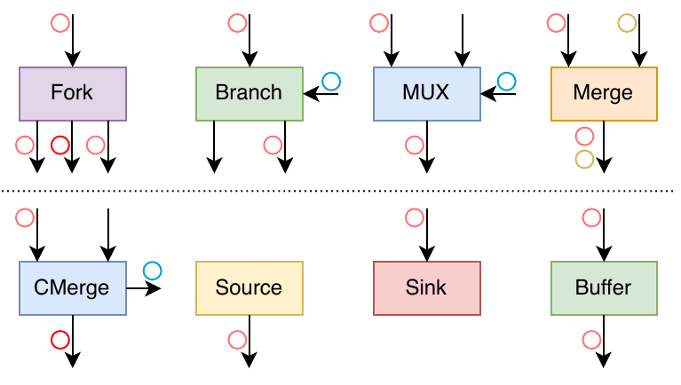

*Figure 1: The handshake components FTD builds with. A Fork duplicates a token; a Branch steers its data token to one of two outputs according to a select token; a Mux forwards one of two data inputs chosen by a select; Merge and CMerge join token streams (CMerge also emits the index of the winning input); a Source emits tokens on demand; a Sink absorbs and discards them; a Buffer stores them.*

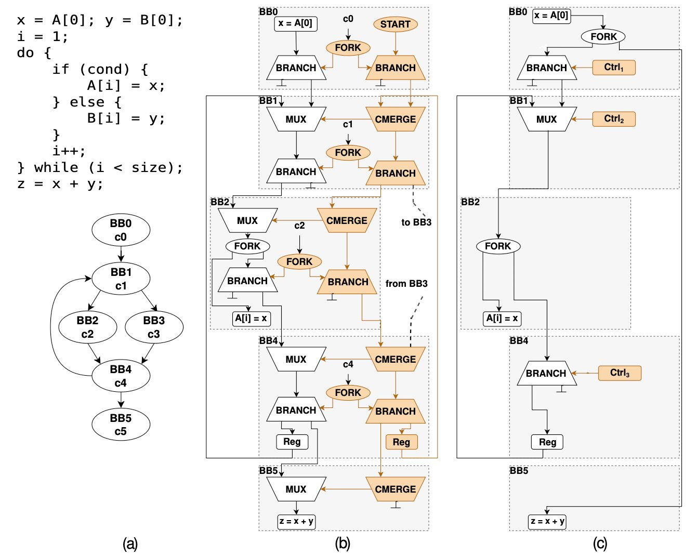

*Figure 2: What FTD changes. (a) A do-while kernel and its CFG. (b) The standard lowering: a control-merge network (orange) replays the block-by-block control flow, and every live value is steered through per-block Mux/Branch pairs even when its producer and consumer are far apart. (c) The same kernel after FTD: each value travels directly from its producer to its consumer, and only the select/suppression circuitry that token matching actually requires (the Ctrl boxes) remains.*

The defining property the circuit must preserve is **token matching**: at every operation, the inputs that fire together must correspond to the same logical execution. In a sequential program the compiler guarantees this; in a dataflow circuit, where control flow is resolved at run time, two things go wrong on their own:

- A branch is not taken, but the producer already emitted a token the consumer will not read. The surplus token stays in the channel and desynchronizes every later token. It must be **discarded**.
- The consumer is inside a loop the producer is not in. The producer fires once, but the consumer reads the value every iteration. The single token must be **replayed** once per iteration.

FTD fixes both with two primitives placed on the producer→consumer channel:

- **Suppression** is a `ConditionalBranchOp` whose select is a Boolean *suppression condition* `F_supp`. The branch's *true* output is left dangling (a sink) and its *false* output feeds the consumer. When `F_supp` is true the token is routed to the sink and discarded; when false it passes through. Equivalently the circuit can compute the *consumption condition* `F_cons = ¬F_supp` and swap the branch outputs; the code uses whichever is more convenient and they are always negations of each other.
- **Regeneration** is a `MuxOp` at a loop header with a feedback edge: the first iteration forwards the external token, later iterations forward the mux's own previous output.

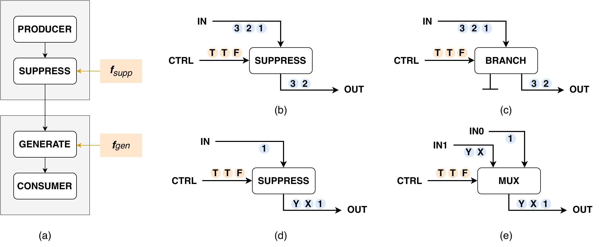

*Figure 3: The delivery primitives and their realization. (a) The generic delivery path places a SUPPRESS after the producer and a GENERATE before the consumer. (b, c) SUPPRESS drops the tokens whose control token is true; it is a Branch whose true output ends in a Sink — the token streams next to the ports show two tokens passing and one being discarded. (d, e) GENERATE injects a fresh token when its control token is true; it is a Mux with one input tied to a Source. FTD needs generation only to replay tokens into loops, which it implements as the regeneration mux of the Regeneration section.*

The hard part is computing `F_supp` *and emitting it as a circuit that itself satisfies token matching*. A naive expression circuit re-reads the same condition token on several paths and breaks matching internally; most of the suppression algorithm exists to avoid that.

### Block indexing and condition variables

Boolean conditions in FTD are named after basic blocks. `BlockIndexing` assigns every block an index such that a dominator always gets a smaller index than the blocks it dominates:

```cpp
// FtdSupport.cpp — BlockIndexing constructor
llvm::sort(allBlocks, [&](Block *a, Block *b) { return domInfo.dominates(a, b); });
for (auto [blockID, bb] : llvm::enumerate(allBlocks)) {
  indexToBlock.insert({blockID, bb});
  blockToIndex.insert({bb, blockID});
}
```

The branch condition of block `N` is the string `"cN"` (`getBlockCondition`), and `getBlockFromCondition("cN")` maps it back to the block. So a Boolean such as `c0 ∧ ¬c3` means *block 0 branched one way and block 3 the other*. `isLess(a, b)` compares indices and is used throughout as a cheap "a is above b in the dominance order" test. The polarity convention is fixed: leaving a conditional block by its **false** edge contributes the negated literal `¬cN`, by its **true** edge the plain literal `cN`.

### The shadow CFG

The conversion that produces the Handshake IR (`CfToHandshake`) flattens the multi-block CFG into a single block. Every analysis FTD needs — dominance, loop nesting, control dependence, path enumeration — requires the original block structure, which no longer exists.

`ShadowCFG` solves this. It is a private `func.func` that keeps a copy of the original CFG, with real `cf` terminators, plus a map from block index to the real Handshake condition `Value`:

```cpp
// FtdSupport.h
struct ShadowCFG {
  mlir::func::FuncOp shadowFunc;
  llvm::DenseMap<unsigned, mlir::Value> conditionMap;

  mlir::Region &getRegion() { return shadowFunc.getBody(); }
  mlir::Block  *getBlock(unsigned bbIdx);          // index → shadow block
  unsigned      getBlockIndex(mlir::Block *block); // shadow block → index
  mlir::Value   getCondition(unsigned bbIdx);      // index → real cond Value
};
```

All graph analysis runs on `getRegion()` as if the original CFG were alive. The one thing the shadow cannot synthesize — the real condition wire of a conditional block — is fetched from `conditionMap` through `getCondition`. The shadow is the bridge between "reasoning about the CFG" and "wiring real signals," and every entry point (`insertDirectSuppression`, `computeLoopBackedgeCondition`, the GSA and regeneration passes) carries a `ShadowCFG &`.

### The pass order

FTD runs these steps on a Handshake function, in this order:

1. `createAllCondPlaceholders` — stand-ins for each block's condition (see [Condition placeholders](#condition-placeholders)).
2. `addGsaGates` — turn φ/GSA gates into muxes (see [GSA gate conversion](#gsa-gate-conversion)).
3. `addRegen` — regeneration muxes for cross-loop dependencies (see [Regeneration](#regeneration)).
4. `addSupp` — suppression circuitry (the next, central section).
5. `resolveCondPlaceholders` / `finalizeCondPlaceholders` — substitute real condition signals.

`addSupp` filters producer–consumer pairs before doing any work. `addSuppOperandConsumer` returns early for memory operations, control merges, and the non-condition inputs of conditional branches, among others; whatever remains is passed to `insertDirectSuppression`.

## The suppression algorithm

Given a producer value and a consumer operation, suppression computes the condition under which the token must be discarded and emits a circuit for it. The work is a pipeline; each stage is a separate function and several stages are reused by regeneration and GSA conversion.

```
buildLocalCFGRegion      reconstruct the relevant control flow      §3.1
buildDecisionGraph       keep only the deciding branches            §3.2
CyclicGraphManager       decompose loops into acyclic layers        §3.3
enumeratePaths           paths → Boolean F_cons → F_supp            §3.4
expressionToCircuit      Boolean → mux-tree circuit                 §3.5
buildDistributionNetwork make the condition tokens read-once        §3.6
CyclicDemotionHelper     move condition tokens across loop levels   §3.7
insertDirectSuppression  drive everything; emit the branch          §3.8
```

### 3.1 The local CFG

We do not analyze the whole function, only the part of the CFG a token can traverse from the producer block to the consumer block. `buildLocalCFGRegion` reconstructs that slice as a fresh, standalone region and stores it in a `LocalCFG`:

```cpp
// FtdSuppression.h
struct LocalCFG {
  Region *region = nullptr;
  DenseMap<Block *, Block *> origMap;   // local block → original block
  Block *newProd = nullptr;             // entry (the producer)
  Block *newCons = nullptr;             // the consumer
  Block *secondVisitBB = nullptr;       // self-loop delivery (producer == consumer)
  Block *sinkBB = nullptr;              // unique exit; every discarded path ends here
  SmallVector<Block *, 8> topoOrder;
  Operation *containerOp = nullptr;     // throwaway func that owns the region
};
```

Producer and consumer can sit in several positions relative to the loops of the CFG: in the same loop with the consumer ahead (delivery within an iteration) or behind (delivery across the back edge, into the next iteration), producer inside a loop with the consumer after it, or with a whole loop lying between them. The construction does not case-split — one set of edge rules covers every shape.

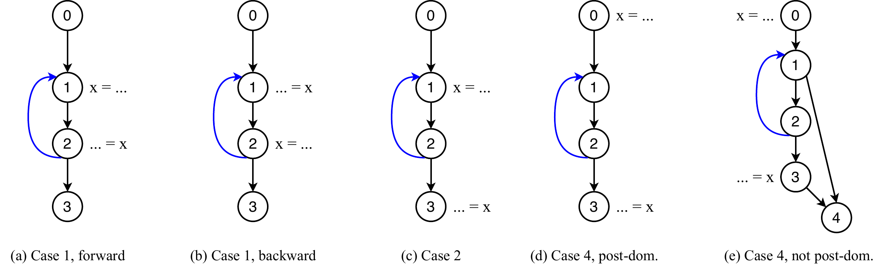

*Figure 4: The delivery shapes the construction must handle (back edges in blue, producer `x = ...`, consumer `... = x`). (a) Same loop, forward delivery within an iteration. (b) Same loop, consumer before the producer: the delivery crosses the back edge into the next iteration. (c) Producer inside the loop, consumer after it. (d, e) A loop between producer and consumer: in (d) every path to the consumer traverses the loop (the consumer post-dominates it); in (e) a bypass edge exists and the loop may be skipped.*

Construction is a DFS from the producer block. The destination of each outgoing edge is decided by a fixed set of rules, and **the order of the checks matters**:

```cpp
// FtdSuppression.cpp — buildLocalCFGRegion, per successor (paraphrased control flow)
if (succOrig == origCons)            nextLocal = clone(origCons) → newCons → sink;  // deliver
else if (succOrig == origProd)       nextLocal = sinkBB;                            // looped back, discard
else if (cloned.count(succOrig))     nextLocal = cloned[succOrig];                  // reuse: keep on-path loops as cycles
else if (visited.count(succOrig))    nextLocal = sinkBB;                            // defensive
else if (bi.isLess(succOrig, curr))  nextLocal = sinkBB;                            // region-leaving back edge, discard
else                                 nextLocal = clone(succOrig); recurse;          // new forward edge
```

Two-way branches are emitted as `cf.cond_br` with a placeholder condition (a constant); one-way as `cf.br`; the sink is closed with `func.return`. The "reuse already-cloned block" check is placed before the back-edge check on purpose: it is what keeps a loop lying on a producer→consumer path as a real cycle in the local graph, which the loop machinery in §3.3 depends on. When producer and consumer are the same block (used for loop-backedge conditions), a dedicated `secondVisitBB` represents reaching the consumer on the second visit.

After the DFS the region is given a topological order and physically reordered so `region.front() == newProd`, because the downstream control-dependence analysis starts its traversal from the first block.

The resulting graph has four properties that the rest of the algorithm relies on:

1. It has a unique source (`newProd`) and a unique sink (`sinkBB`); every path from the source reaches the sink.
2. Apart from on-path loops, it is a DAG.
3. A path that passes through `newCons` is a delivery; a path that reaches `sinkBB` without passing through `newCons` is a suppression.
4. **`F_supp` is true exactly when control flow takes a path that reaches `sinkBB` without passing through `newCons`.**

Property 4 is the linchpin: it reduces "should this token be discarded?" to a reachability question on this graph. Everything downstream is a way of computing and realizing that condition. If `buildLocalCFGRegion` is ever changed, this is the property to preserve.

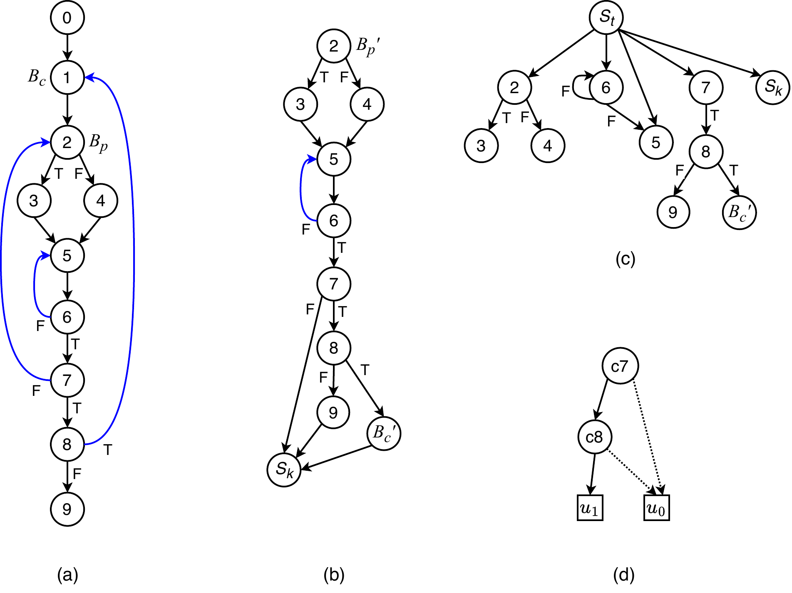

*Figure 5: From the original CFG to the decision graph. (a) The original CFG, back edges in blue; the producer B_p is block 2 and the consumer B_c is block 1, so the delivery crosses a back edge. (b) The local CFG: block 2 re-enters as the entry B_p′, the consumer is reached as B_c′, every non-delivering edge is cut to the sink S_k, and the on-path loop 5↔6 survives as a real cycle. (c) The control-dependence graph of the local CFG (S_t is the entry node). (d) The decision graph: of all the branches, only c7 and c8 decide whether B_c′ is reached; dashed edges are false edges.*

### 3.2 The decision graph

Most blocks in the local CFG have a single successor and cannot affect whether `newCons` is reached. `buildDecisionGraph` removes them, keeping only the blocks that matter:

```
nodeSet = { newCons, sinkBB } ∪ controlDependences(newCons)
```

where the control dependences come from `ControlDependenceAnalysis` on the local region. The kept blocks are cloned into a new region; edges that used to pass through a removed block are forwarded to the nearest kept successor; and a synthetic `dummyStart` is prepended so the entry has no incoming back edge (the control-dependence analysis assumes this).

`buildDecisionGraph` also accepts an optional `muxConstraints` map. For a block in this map, the branch corresponding to the *opposite* value is wired straight to the sink, which is how the algorithm expresses "delivery only happens when this block branches this way." This is used by conditional consumption (§3.8) to encode the select condition of a γ-mux consumer.

The result is again a `LocalCFG`: the local CFG reduced to exactly the `if`s that decide delivery. Figure 5(c) and 5(d) show the step on the running example — the control-dependence analysis singles out c7 and c8, and the decision graph keeps just those two branches plus the terminals.

### 3.3 Decomposing loops into acyclic layers

Control-dependence analysis, path enumeration, and BDD construction all assume an acyclic graph, but a decision graph may contain loops. `CyclicGraphManager` analyzes the loop structure and can flatten any single nesting level into a DAG.

It first builds a tree of loop scopes:

```cpp
// FtdSuppression.h
struct LoopScope {
  unsigned level = 0;                 // 0 = acyclic top scope; 1 = top-level loops; ...
  Block *header = nullptr;            // loop header (graph entry for level 0)
  SmallVector<Block *> latches;       // blocks whose back edge targets the header
  DenseSet<std::pair<Block *, Block *>> allBackEdges;  // incl. nested loops' back edges
  DenseSet<Block *> allBlocksInclusive;                // all blocks in this scope
  SmallVector<std::unique_ptr<LoopScope>> subLoops;
  LoopScope *parent = nullptr;
  mlir::CFGLoop *loopInfo = nullptr;
};
```

`extractLayeredCFG(scope)` then clones the scope's blocks and rewrites edges so the result is a DAG:

- a back edge to **this scope's own header** is redirected to the **false terminal** (`sinkBB`), meaning "stop iterating";
- a back edge belonging to an **inner loop** is cut (that inner loop's own layer will represent it);
- an edge **leaving this scope** is redirected to the **true terminal** (`newCons`), representing the loop exit;
- a **residual back edge** that `CFGLoopInfo` did not classify — which happens for irreducible cycles — is detected from the input's topological order and also cut to the false terminal.

For level 0 the true and false terminals are mapped to the real consumer and sink; for deeper levels they stand for "exit" and "iterate again." Level 0 only drops dead blocks; deeper levels are fully canonicalized so every non-terminal block ends in a conditional branch.

The effect is that each nesting level becomes its own DAG on which the acyclic machinery applies unchanged. A level-`k` layer answers, for a loop, *does control flow exit the loop or return to the header this iteration*. Connecting the levels is the job of demotion (§3.7).

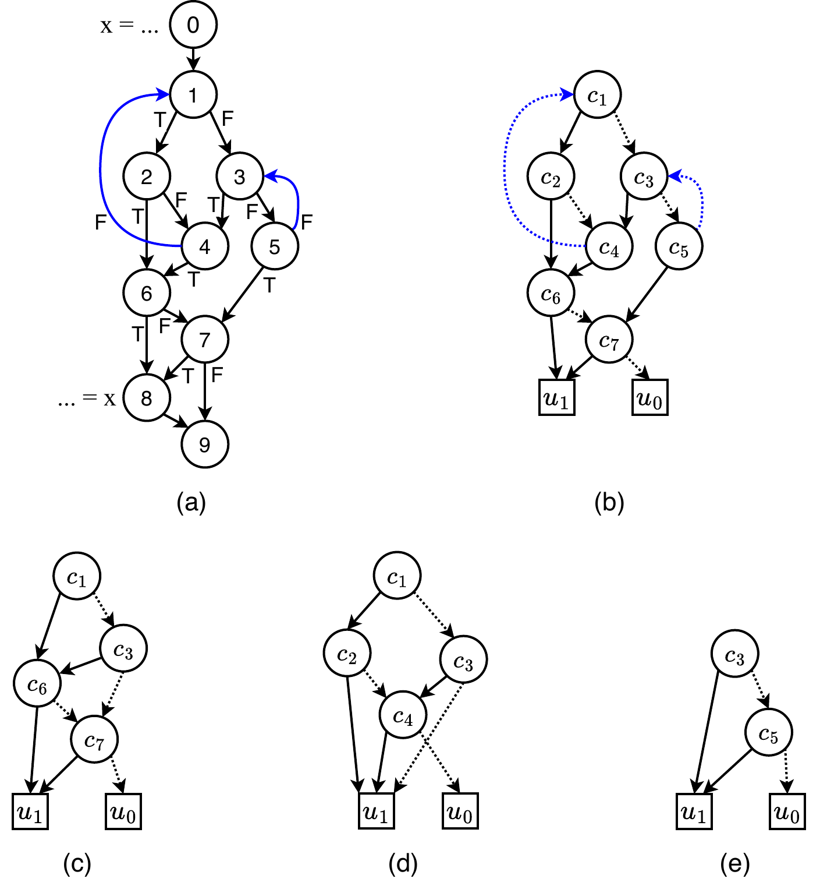

*Figure 6: Layered decomposition of a cyclic decision graph. (a) A CFG with two nested loops (back edges in blue): the outer loop is headed by block 1 with latch 4, the inner by block 3 with latch 5; the producer is in block 0 and the consumer in block 8. (b) The cyclic decision graph (dashed = false edges, u1/u0 = the true/false terminals). (c) The level-0 layer: both loops collapsed, leaving the acyclic decision over c1, c3, c6, c7. (d) The level-1 layer for the outer loop: its back edge becomes the false terminal ("iterate again"), its exits the true terminal, the inner loop's back edge is cut. (e) The level-2 layer for the inner loop.*

### 3.4 Paths to a Boolean condition

On an acyclic decision graph, `enumeratePaths` walks every path from `newProd` to `newCons` (an iterative DFS that stops at the sink and refuses to revisit a block already on the current path), and converts each path to one product term with `getHybridPathExpression`:

```cpp
// FtdSuppression.cpp — getHybridPathExpression, per edge u → v on the path
if (localDeps.contains(u) && isa<cf::CondBranchOp>(u->getTerminator())) {
  bool isTrueEdge = (u->getTerminator()->getSuccessor(0) == v);
  // variable name comes from the ORIGINAL block; polarity from the LOCAL structure
  std::string var = bi.getBlockCondition(lcfg.origMap.lookup(u));
  literal = isTrueEdge ? var : ¬var;
  term = term ∧ literal;
}
```

The function is "hybrid" because it takes the **variable name** from the original CFG block (so it names a real condition signal) and the **polarity** from the local graph's edge structure, and it only emits a literal when the source block is in the control-dependence set. OR-ing the per-path terms and minimizing gives the consumption condition:

```
F_cons = boolMinimizeSop( OR over delivering paths of (AND of edge literals) )
F_supp = boolMinimize( ¬F_cons )
```

For a single `if` whose then-branch contains the producer and whose join contains the consumer, the only delivering path takes block 0's true edge, so `F_cons = c0` and `F_supp = ¬c0`. Two delivering paths `c0·c3` and `c0·¬c3` minimize to `F_cons = c0`, again `F_supp = ¬c0`.

### 3.5 Boolean to a mux tree

`expressionToCircuit` lowers a Boolean to hardware. It minimizes the expression, orders the variables by the block topological rank (this fixes the BDD variable order so the mux tree mirrors the dependency order), builds a BDD, and lowers it:

```cpp
// FtdSuppression.cpp — expressionToCircuit
expr = expr->boolMinimize();
// sort variables c.. by varRank (topological position of their block)
BDD *bdd = buildBDD(expr, cofactorList);
return bddToCircuit(builder, bdd, insertBlock, registry, {}, bi, ...);
```

`bddToCircuit` turns the BDD into a mux tree recursively. An internal node becomes a `MuxOp` whose select is the node variable's condition signal and whose two data inputs are the lowered false- and true-subtrees; a leaf becomes a constant (`SourceOp` + `ConstantOp`) or a condition signal, with a `NotIOp` for a negated literal:

```cpp
// FtdSuppression.cpp — bddToCircuit (mux node)
Value muxCond = registry.lookup(varName, currentPath);          // the right copy of the signal
if (!muxCond) muxCond = getOriginalValue(builder, varName, ...); // fallback: real signal via shadow

PathContext falsePath = currentPath; falsePath.push_back({varName, false});
PathContext truePath  = currentPath; truePath.push_back({varName, true});
muxOperands = { bddToCircuit(..., bdd->successors->first,  ..., falsePath, ...),
                bddToCircuit(..., bdd->successors->second, ..., truePath,  ...) };
auto muxOp = builder.create<handshake::MuxOp>(loc, type, muxCond, muxOperands);
muxOp->setAttr(FTD_OP_TO_SKIP, builder.getUnitAttr());
```

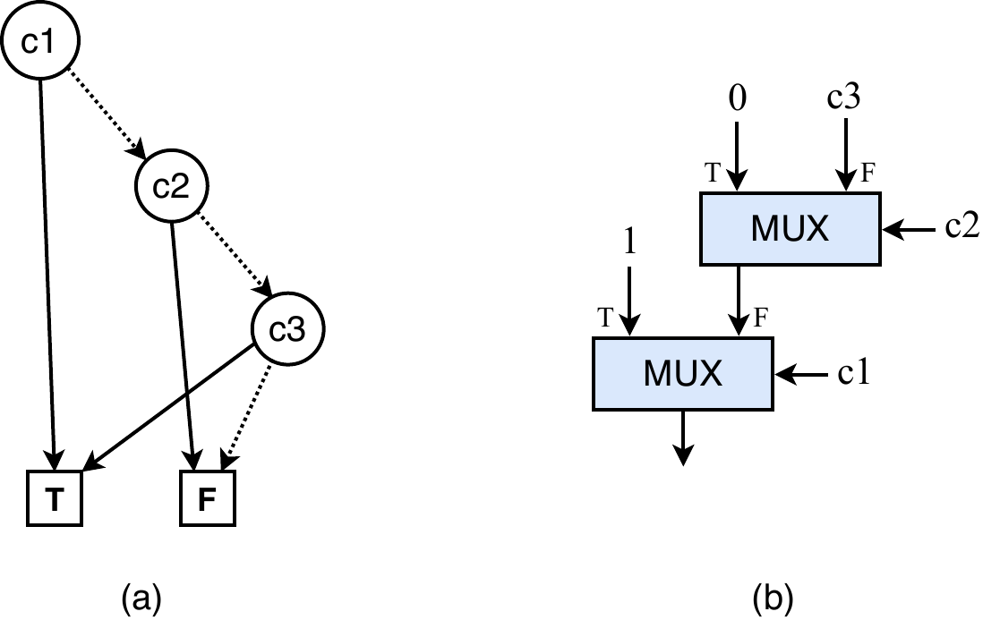

*Figure 7: A BDD and its mux tree. (a) The BDD over c1, c2, c3 (dashed = false edges; T/F are the terminals). (b) The lowered circuit: each internal vertex becomes a Mux selected by its variable, each terminal a constant. The root variable c1 ends up as the select of the output mux because the variable order follows the blocks' topological order.*

Two details are load-bearing. First, the select signal is fetched from a `SignalRegistry` keyed by the **current path context**, not taken directly from the block — that is what §3.6 sets up. Second, every operation emitted here is tagged `FTD_OP_TO_SKIP` so later FTD passes do not treat it as ordinary IR. The fallback `getOriginalValue` is where the shadow CFG is consulted: it maps `cN` to a block and asks the shadow for the real condition `Value` (or, before flattening, a condition placeholder).

### 3.6 Token distribution — making the mux tree read-once

This is the stage that makes the suppression circuit itself satisfy token matching, and it is the reason the algorithm is more than "build a BDD."

The problem: a BDD-derived mux tree is generally **not read-once**. The same condition variable can label more than one mux input, because a BDD vertex can be reachable from the root by several distinct paths. If the single physical condition wire fans out to all those mux inputs, the inputs see the token at the wrong rate and on the wrong paths, and the muxes deadlock or mismatch. Token matching inside the expression circuit is violated even though the Boolean is correct.

The fix is to **split each shared condition variable into per-path copies**, so that each copy labels at most one mux input. The copies are produced by routing the original condition token down a small branch tree that follows the control flow, dropping the token on the sub-paths where it is not needed.

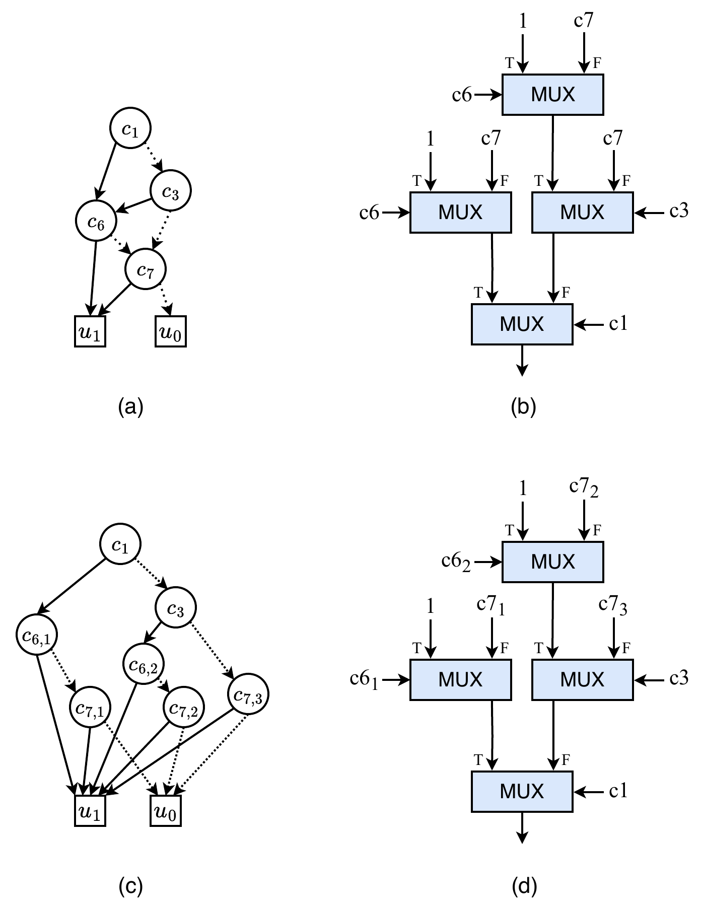

*Figure 8: Why splitting is necessary, on the level-0 layer of Figure 6. (a) The ROBDD: vertex c6 is reachable from the root by two distinct paths and c7 by three. (b) The mux tree lowered directly from it is not read-once — the single c6 token would have to feed two mux selects and c7 three, which token matching cannot satisfy. (c) The ROBDD after splitting: c6 becomes c6,1 and c6,2, c7 becomes c7,1–c7,3, and every vertex is reachable by a unique path. (d) The resulting mux tree is read-once: each split copy drives exactly one select.*

The bookkeeping is the `SignalRegistry`:

```cpp
// FtdSuppression.h
struct PathStep { std::string var; bool value; };       // one branch decision
using PathContext = std::vector<PathStep>;              // a path as a list of decisions

struct SignalRegistry {
  std::map<std::string, std::vector<std::pair<PathContext, Value>>> map;
  void  registerSignal(StringRef var, const PathContext &path, Value val);
  Value lookup(StringRef var, const PathContext &queryPath);  // longest-prefix match
};
```

`lookup` returns the registered signal whose path is the **longest prefix** of the query path — the copy defined closest to the current control-flow context:

```cpp
// FtdSuppression.cpp — SignalRegistry::lookup (core)
for (auto &[regPath, val] : map[var]) {
  if (regPath.size() > queryPath.size()) continue;
  bool isPrefix = std::equal(regPath.begin(), regPath.end(), queryPath.begin());
  if (isPrefix && (!found || regPath.size() >= bestLen)) { bestLen = regPath.size(); best = val; }
}
```

`buildDistributionNetwork` drives this. It collects, for every condition variable, the set of paths on which it is needed (each a `VariableRequirement{varName, path}`), and for any variable needed on more than one path it calls `buildBranchTreeRecursive`:

1. **Find the split point** — scan the requirement paths forward from the current depth to the first step where they disagree on a variable's value.
2. **Filter invalid sub-paths first.** Before splitting, `generateReachabilityLogic` builds the suppression condition for the *remaining* path suffix — `F_supp = ¬(OR of the still-valid path suffixes)` — and inserts a suppression branch that drops the condition token on sub-paths that will not be taken:

   ```cpp
   // generateReachabilityLogic
   for (req : requirements) pathExpr = AND over suffix of SingleCond(step.var, /*negated=*/!step.value);
   fValid    = OR of pathExpr;
   fSuppress = fValid->boolNegate()->boolMinimize();
   return bddToCircuit(fSuppress, ...);   // a mux tree, looked up through the registry
   ```
3. **Split.** A conditional branch on the split variable separates the (filtered) signal into a true side and a false side.
4. **Register and recurse.** Each output is registered under its extended path context, skipped common-prefix steps are back-filled so path indices stay aligned, and the procedure recurses into each group.

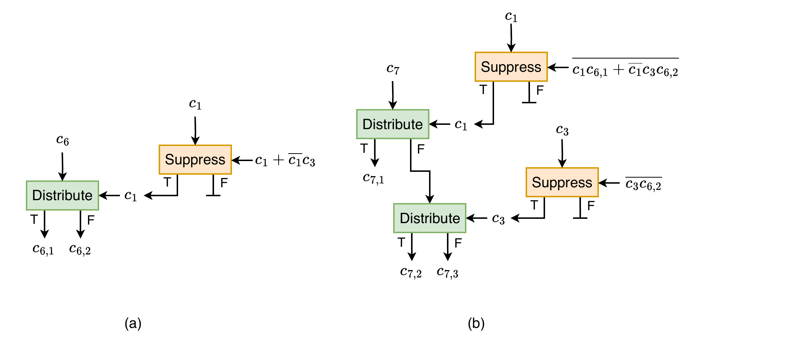

*Figure 9: The distribution circuits that produce the split copies of Figure 8 (Distribute and Suppress are both Branches; Suppress sinks one output). (a) The two copies of c6: the c1 token is first passed through a suppression branch whose control encodes the validity of the remaining sub-paths (c1 + ¬c1·c3), so it is dropped where no copy of c6 is needed; the surviving token then splits the c6 stream into c6,1 (true side) and c6,2 (false side). (b) The three copies of c7: the filtered c1 token splits the c7 stream once, and the false side is split again by the filtered c3 token, yielding c7,1, c7,2, and c7,3. Every select that feeds a Distribute is filtered first — exactly steps 2–3 of the recursion.*

When `bddToCircuit` later looks up a variable for a mux select, the longest-prefix match returns the copy produced for exactly that path, and the mux tree is read-once by construction.

### 3.7 Token demotion across loop levels

A condition variable defined inside a loop produces one token per iteration. A consumer or a mux at an outer level needs a single representative token, not one per inner iteration; the counts must be reconciled before the variable can be distributed at the outer level.

`CyclicDemotionHelper` does this. It is constructed with the loop analysis (`CyclicGraphManager`), the original-block → decision-graph-block map, and the shadow:

```cpp
// FtdSuppression.h — fields that matter
CyclicGraphManager &cyclicMgr;             // source of loop scopes and layered CFGs
DenseMap<Block *, Block *> &origToFullDG;  // original block → decision-graph block
std::map<std::pair<std::string, unsigned>, Value> demotionCache;  // (var, level) → value
```

`demoteOneLevel(value, block, fromLevel)` lowers a value from `fromLevel` to `fromLevel − 1`:

1. Extract the acyclic layered CFG of that loop scope (§3.3).
2. Run control dependence to get the header→exit dependences.
3. Build a level-local registry, recursively demoting any deeper-level dependence variables down to this level.
4. Build the distribution network on the layered CFG, then evaluate the header→exit suppression condition and use it to gate the value so that **only the token of the iteration that reaches the loop exit survives**. That single token now lives one level out.

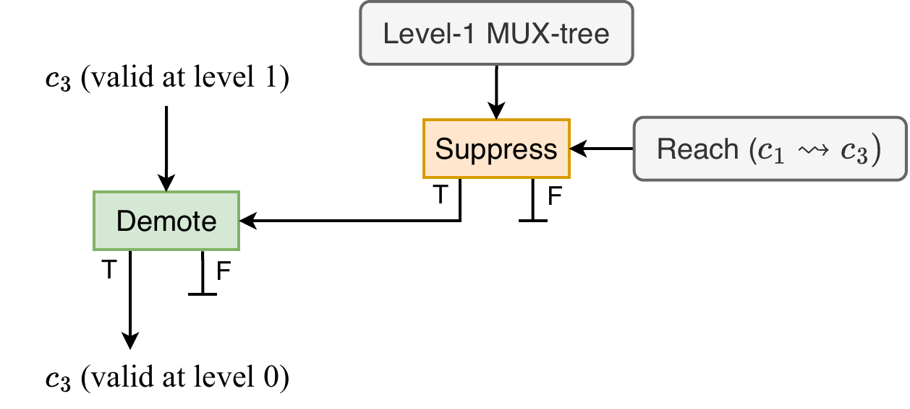

*Figure 10: One demotion step. The header→exit reachability condition of the loop (here, that c1's path reaches c3) is evaluated by the level-1 mux tree and gates a Suppress branch; its surviving token drives the Demote branch, which lets through exactly one c3 token per loop execution — the one belonging to the exiting iteration. The c3 stream that was valid at level 1 (one token per iteration) emerges valid at level 0 (one token per execution).*

`getValueAtLevel(var, targetLevel)` recurses down level by level and caches each `(var, level)` result so the same demotion circuit is never built twice. `preRegisterDemotedValues` demotes every deep variable in a decision graph to level 0 and registers the result, so the distribution stage (§3.6) finds it ready.

Demotion and distribution are deliberately independent: at each level the original block token is forked, one copy entering that level's distribution circuit and the other being demoted to the next level. A copy made for one level's distribution does not correspond to any input of another level's mux tree, so demotion always operates on the original per-block token, never on a split copy.

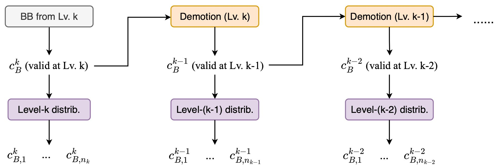

*Figure 11: The separation of demotion and distribution for a condition variable c_B native to nesting level k. At each level the token is forked: one copy enters that level's distribution circuit, which produces the split copies c_B,1 … c_B,n for that level's mux tree; the other copy is demoted and repeats the pattern one level down. Distribution never feeds demotion and vice versa.*

### 3.8 Driving it all: `insertDirectSuppression`

This is the orchestrator. It places, builds, and emits the suppression circuit for one producer value consumed by one operation.

**Locate and place.** Producer and consumer are mapped to shadow blocks through their `handshake.bb` attributes. The suppression ops are tagged to the producer's block by default; if the consumer is a **loop header that encloses the producer**, they are tagged to the loop's first exit block instead (`getFirstLoopExitBBAttrIfHeaderConsumer`). If the producer block is unreachable from the entry, there is nothing to suppress and the function returns.

**Conditional consumption (delivery to a γ-mux).** When the consumer is a γ-mux (a `MuxOp` tagged `FTD_EXPLICIT_GAMMA`) and the producer is one of its *data* inputs, whether the token is used depends not only on the path but also on the mux's select. The analysis start block must move up to a block that dominates the producer and controls the delivery. `insertDirectSuppression` walks down the chain of γ-muxes in the same block:

```cpp
// FtdSuppression.cpp — chain walk to find the dominating condition block
if (currentMuxOp->getOperand(0) != currentConnection) {     // connection is a DATA input
  Block *condBlock = returnMuxConditionBlock(currentMuxOp->getOperand(0), shadow);
  bool bothReach = condBlock->getNumSuccessors() >= 2 &&
                   isReachableAcyclic(condBlock->getSuccessor(0), producerBlock) &&
                   isReachableAcyclic(condBlock->getSuccessor(1), producerBlock);
  if (bothReach && bi.isLess(condBlock, lastValidDominator))
    lastValidDominator = condBlock;     // earliest such block dominates the others
}
// then descend to the next gamma mux fed by this one in the same block ...
dominatorBlock = lastValidDominator;
// finally take the nearest common dominator of producer, dominatorBlock, and every
// block whose condition the suppression expression depends on:
for (Block *cb : collectSuppressionConditionBlocks(producerBlock, consumerBlock, bi))
  dominatorBlock = domInfo.findNearestCommonDominator(dominatorBlock, cb);
```

It also records, for each mux on the chain, which select value passes the producer's input (operand 1 is the false input, operand 2 the true input). Those become `muxConstraints` for the decision graph, which wires the non-selecting branch to the sink.

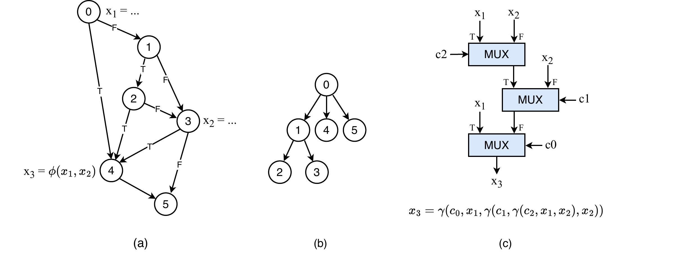

*Figure 12: A consumer that is a γ-tree input. (a) The CFG: x1 is defined in block 0, x2 in block 3, and x3 = φ(x1, x2) at block 4. (b) The dominator tree. (c) The γ-tree x3 = γ(c0, x1, γ(c1, γ(c2, x1, x2), x2)): whether a given x1 token is consumed depends not only on reaching block 4 but on the selects of every mux between its input and the tree's output — which is exactly what the recorded mux constraints encode.*

**Main condition.** With `dominatorBlock` chosen, the driver builds `buildLocalCFGRegion(dominatorBlock, consumerBlock)`, its decision graph, and the level-0 acyclic layer. It builds the distribution network on the **unconstrained** level-0 graph (so the network covers all paths and all condition copies exist), then enumerates paths on the **constrained** level-0 graph to get the dominator-to-consumer consumption condition — call it `f_DC` — and negates it:

```cpp
BoolExpression *fCons = enumeratePaths(*level0ConstrainedDG, bi, constrainedDeps)->boolMinimize();
BoolExpression *fSup  = fCons->boolNegate()->boolMinimize();
```

**Upstream filter `F_supp_DP`.** When `dominatorBlock` is above the producer, the producer does not fire on every path that reaches the start block, so the main condition would suppress tokens the producer never emitted. `F_supp_DP` is the suppression condition for the `dominatorBlock → producerBlock` stretch — the negation of the dominator-to-producer condition `f_DP` — computed by the same pipeline on a separate local CFG; it is cascaded in to remove those cases, and is zero when the start block is the producer.

**Loop filter.** When the producer sits in a deeper loop than `dominatorBlock`, it fires several times per delivery. The driver walks the post-dominator tree up from the producer to the block at the dominator's loop depth — the loop exit — and gates the producer token so only that iteration's token survives.

**Emit.** The three conditions are realized as circuits and composed with branches, all tagged `FTD_OP_TO_SKIP` and `handshake.bb`:

```cpp
// FtdSuppression.cpp — emission (when fSup is not the constant zero)
Value branchCond = expressionToCircuit(builder, fSup, rank, producerIRBlock, registry, bi, ...);

if (fSupDP != 0) {                       // filter the suppression SIGNAL by the upstream condition
  Value dpCond = expressionToCircuit(builder, fSupDP, rankDP, producerIRBlock, registry, bi, ...);
  auto dpBranch = builder.create<handshake::ConditionalBranchOp>(loc, types, dpCond, branchCond);
  branchCond = dpBranch.getFalseResult();
}

auto branchOp = builder.create<handshake::ConditionalBranchOp>(loc, types, branchCond, supData);
supData = branchOp.getFalseResult();     // the FALSE output is the delivered token
// rewire the consumer's use of the producer value to supData
```

The producer token enters the loop filter, the loop-filtered token enters the main branch, and the main branch's select is the suppression condition (itself filtered by `F_supp_DP`). The branch's false output — the surviving, delivered token — replaces the consumer's original operand. When the suppression condition is the constant zero (no branch decision affects delivery) no branch is emitted. The opposite degenerate case, where the consumer is unreachable on every kept path (`newCons == sinkBB`), emits an always-true suppression so the token is dropped on every execution.

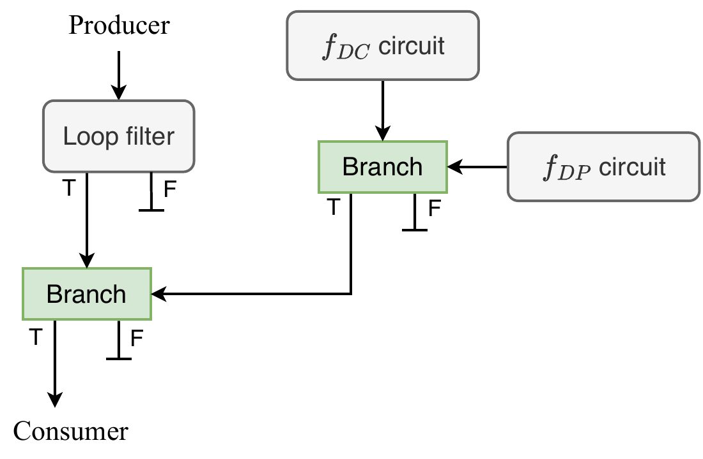

*Figure 13: The assembled suppression circuit, drawn in the consumption form: the f_DC circuit's output (true = consume) is filtered by the f_DP branch to discard activations where the producer never fired; the producer's token is filtered by the loop filter to keep only the final-iteration token; and the main branch delivers on its true output. The implementation emits the equivalent negated form — the select is the suppression condition and delivery happens on the false output — so in the IR the same structure appears with `getFalseResult()` wired to the consumer.*

### 3.9 Reuse for loop conditions

`computeLoopBackedgeCondition(loopHeader)` runs this exact pipeline with producer = consumer = the loop header, yielding the condition that is true when the loop iterates again. It has no final branch — the resulting condition `Value` is returned directly — and it feeds the select inputs of μ-gates (§5) and regeneration muxes (§4), which need the loop-iteration condition rather than a token-dropping branch.

## Regeneration

Regeneration handles the one case suppression does not: a producer outside a loop feeding a consumer inside it. The producer fires once; the consumer needs the value every iteration. `addRegenOperandConsumer` handles one producer–consumer pair:

```cpp
// FtdImplementation.cpp — regeneration outline
SmallVector<CFGLoop *> loops = getLoopsConsNotInProd(consBlock, prodBlock, loopInfo); // outer → inner
if (loops.empty()) return;
for (CFGLoop *loop : loops) {
  Value cond = computeLoopBackedgeCondition(builder, loop->getHeader(), realBlock, bi, nullptr, &shadow);
  auto initSel = builder.create<handshake::InitOp>(loc, cond);     // first iter vs. later iters
  auto mux     = builder.create<handshake::MuxOp>(loc, initSel, {regeneratedValue, regeneratedValue});
  mux->setOperand(2, mux->getResult(0));                           // feedback: later iters reuse own output
  mux->setAttr(FTD_REGEN, ...);
  regeneratedValue = mux.getResult(0);                             // chain outer → inner
}
// rewire the consumer's operand to the innermost regenerated value
```

`getLoopsConsNotInProd` returns the loops that contain the consumer but not the producer, outermost first. Each gets a regeneration mux whose select is the loop's backedge condition (through an `InitOp`, so the first iteration takes the external input and later iterations take the feedback) and whose true data input is its own output. Several enclosing loops chain (outer feeds inner). The pass skips memory operations, control merges, conditional-branch consumers, and producers it created itself (`FTD_REGEN` / `FTD_OP_TO_SKIP`).

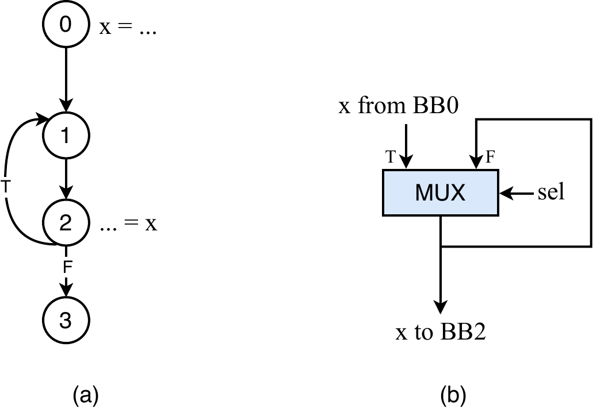

*Figure 14: Regeneration. (a) x is produced in block 0, outside the loop {1, 2}, and consumed in block 2 on every iteration. (b) The regeneration mux at the loop header: the external x token enters once, the feedback edge replays the mux's own output on later iterations, and the select is the loop's backedge condition so the replay stops when the loop exits.*

## GSA gate conversion

`addGsaGates` instantiates the gates of a Gated-SSA analysis as hardware. There are two kinds:

- A **γ-gate** (a conditional choice, e.g. the join after an `if`/`else`) becomes a `MuxOp`. For a single condition the select is the condition placeholder; for a nested condition with several cofactors the select is a small mux tree built with `buildBDD` + `bddToCircuit`. Tagged `FTD_EXPLICIT_GAMMA`.
- A **μ-gate** (a loop-header merge) becomes an `InitOp` + `MuxOp`. The select is `computeLoopBackedgeCondition` for the header, through an `InitOp` so the mux takes the initial value once and the loop value afterward. Tagged `FTD_EXPLICIT_MU`.

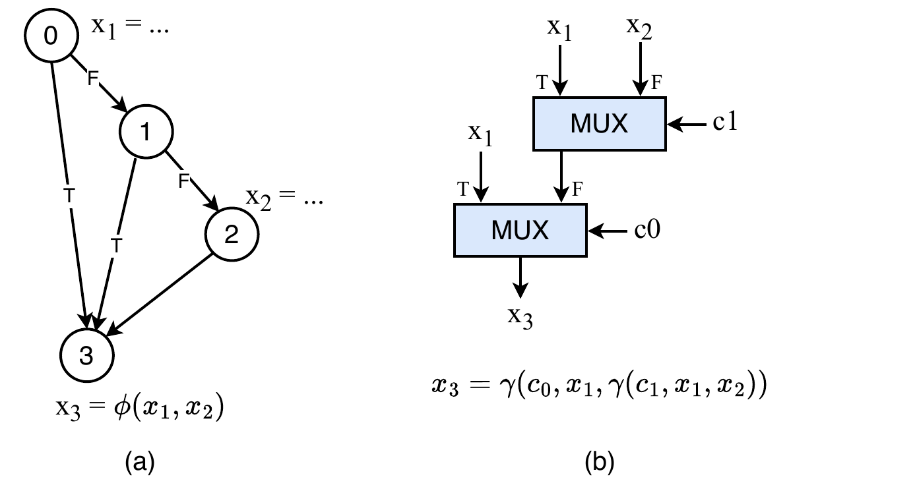

*Figure 15: A γ-gate. (a) x1 is defined in block 0, x2 in block 2, and x3 = φ(x1, x2) merges them at block 3; which definition reaches the merge depends on the branches of blocks 0 and 1. (b) The instantiated γ-tree: x3 = γ(c0, x1, γ(c1, x1, x2)), one mux per deciding condition.*

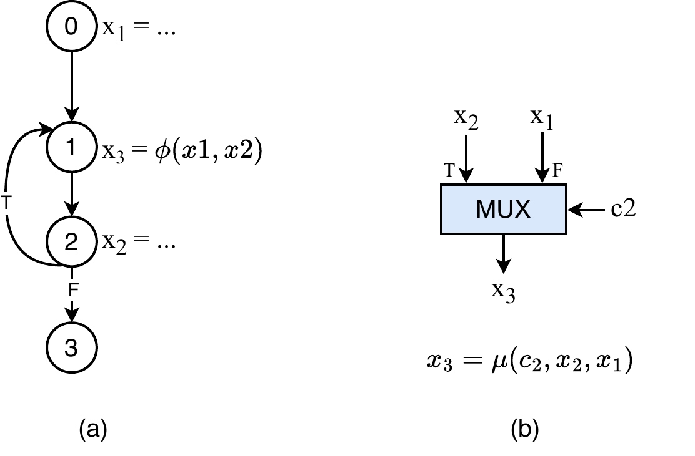

*Figure 16: A μ-gate. (a) x3 = φ(x1, x2) at the loop header merges the external definition x1 (block 0) with the loop-carried definition x2 (block 2). (b) The instantiated mux x3 = μ(c2, x2, x1): the select is the loop's backedge condition c2 — through an InitOp in the implementation, so the first token selects x1 and each iteration thereafter selects x2.*

```cpp
// FtdImplementation.cpp — gate select
if (gate->gsaGateFunction == MuGate)
  conditionValue = computeLoopBackedgeCondition(rewriter, gate->getBlock(), gate->getBlock(), bi, ...);
else if (gate->cofactorList.size() > 1)
  conditionValue = bddToCircuit(rewriter, buildBDD(gate->condition, gate->cofactorList), ...);
else
  conditionValue = /* condition placeholder */;
```

Gate inputs that are themselves not-yet-built gates are filled with backedge placeholders and reconnected afterward (`missingGsaList`), and single-input γ-gates are built through a throwaway placeholder mux. A final pass removes duplicate and degenerate muxes. The φ-network that feeds this conversion (`createPhiNetwork`) is a standard dominance-frontier SSA reconstruction; it inserts merges tagged `NEW_PHI`, which `replaceMergeToGSA` then converts into γ/μ-gates.

## Condition placeholders

The real condition wire of a block may not exist when the algorithm first needs it, and connecting it too early creates dangling backedges. FTD therefore works against stable stand-ins and substitutes the real signals at the end:

1. `createAllCondPlaceholders` puts a `SourceOp → ConstantOp` tagged `FTD_COND_VAR` in each conditional block. Anything needing "the condition of block N" connects here.
2. `resolveCondPlaceholders` replaces each placeholder with a tagged forwarding node fed by the real condition value from the shadow CFG.
3. `finalizeCondPlaceholders` short-circuits those forwarding nodes and erases them.

The net effect is that the whole algorithm runs against placeholders and the real signals are wired in once, decoupling the algorithm from the order in which condition values become available.

## Annotation attributes

FTD tags the IR to recognize its own operations and to drive block-level decisions.

| Constant | String | Meaning |
|---|---|---|
| `FTD_OP_TO_SKIP` | `ftd.skip` | operation generated by FTD; later passes skip it |
| `FTD_EXPLICIT_GAMMA` | `ftd.GAMMA` | mux from a γ-gate (also marks γ-mux consumers for conditional consumption) |
| `FTD_EXPLICIT_MU` | `ftd.MU` | mux from a μ-gate |
| `FTD_REGEN` | `ftd.regen` | regeneration mux |
| `FTD_INIT_MERGE` | `ftd.imerge` | init merges and their initial constants |
| `FTD_COND_VAR` | `ftd.cvar` | condition-variable placeholder |
| `NEW_PHI` | `nphi` | temporary merge from the SSA helper; later converted to a gate |
| `handshake.bb` | — | the block index an operation belongs to; FTD relies on it everywhere |

## Maintenance notes

- **Temporary regions are scaffolding.** Local CFGs, decision graphs, and layered CFGs live in throwaway `func` regions and are erased with `containerOp->erase()` once consumed. Every allocation must be paired with its erase; the driver does this explicitly after each stage.
- **`handshake.bb` must be correct on every FTD-created op.** Placement, loop classification, and condition lookup all key off it; `setBBAttr` / `getBBIndexAttr` exist to keep it consistent.
- **Preserve the local-CFG property** that reaching `newCons` means deliver and reaching `sinkBB` means discard. Most subtle suppression bugs come from violating it.
- **The branch convention is fixed.** Suppression and filter branches deliver on their false output and discard on their true output; expect `getFalseResult()` wherever a delivered token is rewired.
- **Read-once is the correctness criterion for the expression circuit.** If a change makes a condition variable drive two mux inputs on the same path, distribution (§3.6) has been bypassed and token matching will fail at run time even though the Boolean is correct.
