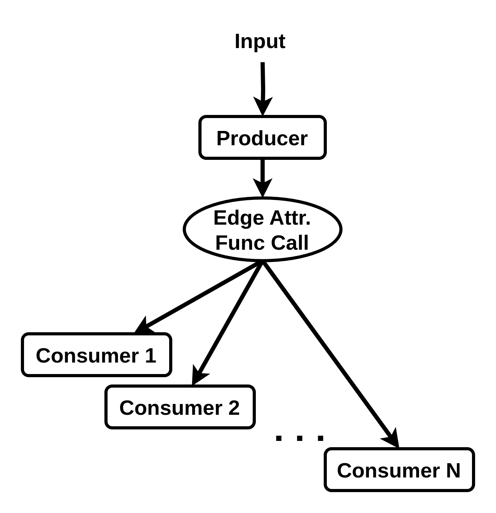
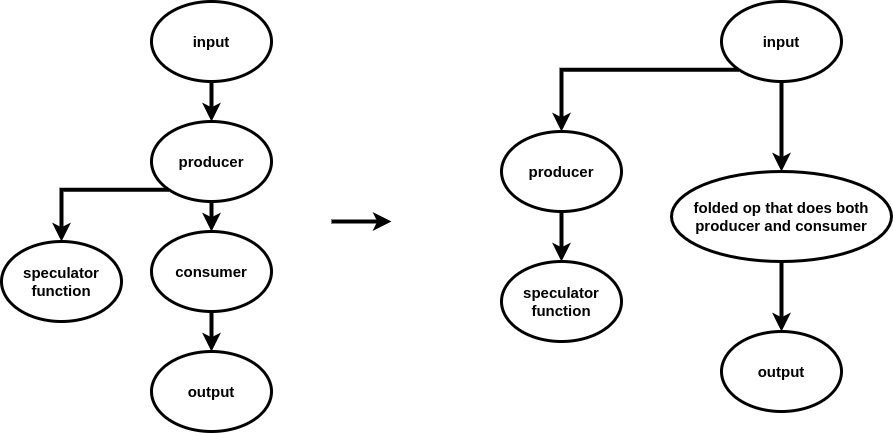

# Producer Output Attributes

Dynamatic has "producer output attributes", which store information about a value in the software-level IR that is shared between all consumers of that value, to pass information annotated on a software-level IR down to our Handshake dialect.

These attributes are represented in 3 different forms across the 3 different levels of our compilation stack. 

## In The LLVM IR

The static nature of the LLVM IR means we cannot easily introduce new concepts. We therefore represent the "producer output attibute" as a function call directly underneath the production of the variable. We can inject this directly into the source code as 

```c++
variable_to_annotate = edge_attribute_function_call(variable_to_annotate, [other attribute parameters]);
```

and causing a use-define chain that looks roughly like this:



If any consumer has multiple possible producers (i.e. is a phi in the LLVM IR), the function call reaches the consumer only along the path from this producer.

We have all consumers which use the value pull from the function call to avoid the producer's output being folded away during the lowering process, like so:




As then the producer output we wished to annotate would no longer exist.

## Inside of Standard MLIR

In the conversion from LLVM to MLIR, we replace the function call with an unregistered `dynamatic.producer_output_attr_marker` operation: a completely opaque operation with no defined structure or verification. This operation belongs to a non-existant `dynamatic` dialect which marks it as part of the Dynamatic project without requiring any new dialect or operation definitions. 

We then place the information from the LLVM function call on this operation as an unregistered attribute specific to the type of annotation, which can have any desired structure as it is again not strictly define.

An example of the serialized form of this unregistered operation with an unregistered attribute is
```
  %21 = "dynamatic.producer_output_attr_marker"(%20) {dynamatic.speculate = {max_predictions = 6 : i64, style = "standard"}} : (i1) -> i1
```

Standard MLIR has good support for unregistered operations, and treats them very similiarly to external function calls. They may (desirably) block certain optimizations, but will not cause compilation to fail.

This allows us to store the desired information and to block the relevant output from being folded away, without the awkwardness of carrying a fake function into the MLIR IR.

## Inside of Handshake

Unlike standard MLIR, Dynamatic's custom dialects and passes were not designed with support for unregistered operations. Thefore, before conversion into the `Handshake` dialect, we remove the unregistered op and transfer the unregistered attribute to the real producer. We also add a secondary attribute specifying which result of the producer the attribute applies to, resulting in a serialized IR similiar to: 
```
  %13 = arith.cmpi slt, %9, %c1000_i32 {dynamatic.speculate = {max_predictions = 6 : i64, style = "standard"}, dynamatic.speculate.result_idx = 0 : i32, handshake.name = "cmpi0"} : i32

```
Any lower pass which wishes to consume this attribute can therefore look for it directly on the relevant operation.

There is still a risk of one of Dynamatic's passes discarding the attribute somehow, but these cases should be investigatable and then alterations proposed, to ensure the attribute is correctly propagated to its desired final destination. 