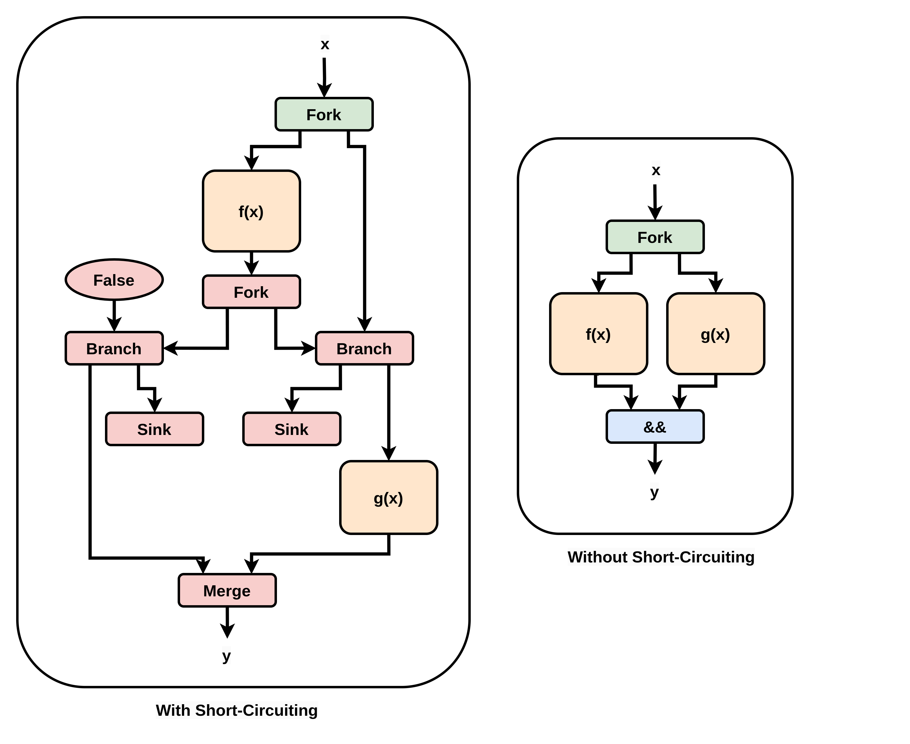

# Source Rewriter

## High-Level Overview

The source rewriter allows alterations to the source-code kernel before compilation begins.

Most of the code in the source rewriter is the use of a boilerplate framework designed for migrating codebases when an API changes, or when moving from one version of C/C++ to another.

The framework allows you to design custom source-code rewrites through the use of a declarative system. You first describe an abstract syntax tree structure to identify as the input, and then specify the new C/C++ code to use as its replacement.

Our understanding of this framework comes from [this talk](https://www.youtube.com/watch?v=bsCpL7r6pkM) by Svyatoslav Feldsherov and his [example code](https://github.com/feldsherov/pets-cattle-and-code-examples/blob/master/transform-example/pointer-to-ref/PointerToRef.cpp).

As the source rewriter alters the code file in place, we work on a copy of the kernel we place in the `comp` folder. This is to make sure the original file is never altered by the source rewriter.

## LibTooling and Transformers

The source rewriter is a standalone C++ binary built using LLVM's LibTooling framework.

The core object is a `RewriteRule`, a declarative object that specifies a source-code transformation. The `RewriteRule`, along with a callback function, is then used to construct a `Transformer`. The callback function is called each time the `RewriteRule` is applied, and is given the output of the `RewriteRule` as its input. The `Transformer` therefore defines both 1) the transformation and 2) what to do when you receive the transformation's results. 

In order to use the `Transformer`, we pass it to a `MatchFinder`, which is the object that actually examines the abstract syntax tree. 

However, it is actually a `StandaloneToolExecutor` which uses the `MatchFinder`, as the `StandaloneToolExecutor` provides the functionality for rewriting an entire codebase in one go.

The source rewriter builds the `StandaloneToolExecutor` through LibTooling command-line arguments: these have two main parts: 1) a list of source files, and 2) the flags they should be compiled with, in order to obtain an abstract syntax tree to examine.

Rather than edit the files as the `RewriteRule` is triggered, we instead save all `RewriteRule` outputs in a `AtomicChanges` object. Once all ASTs have been examined, we begin editing the files. 

However, because the `Transformer` object does not cope well with cumulative edits, for each file we apply only one `AtomicChange` from the `AtomicChanges` object. This is because the `Transformer` framework examines all possible applications of a `RewriteRule` before allowing us to apply any changes, but does not support applying overlapping `AtomicChanges`.

We then re-perform the entire process, so if a file receives multiple `AtomicChanges`, no `AtomicChange` is applied based on a stale input. 

The source rewriter therefore uses a loop that executes the entire flow repeatedly until no file has changed.

## Source Rewriter Flow

A short overview of the steps performed by the Source Rewriter:

1. Declare the CLI args using LLVM registration objects. We use the boilerplate `CommonOptionsParser::HelpMessage` so that a generic "how to use LibTooling tools" message appears for a `--help` call, and a `OptionCategory` registration object to hide unrelated LibTooling args that are not relevant to the Source Rewriter.
2. Build a `CommonOptionsParser` object from the CLI args passed to the tool.
3. Extract a `CompilationDatabase` and vector of source paths from the `CommonOptionsParser` object. We will later use these to construct the `StandaloneToolExecutor`.
4. Build the `NoShortCircuitRewriteRule` we will apply with the `Transformer`.
5. Execute our "apply one change per file repeatedly until no changes are applied loop"

The "apply one change per file repeatedly until no changes are applied loop" has the following steps :
1. Try apply the rewrite rule using the Source Rewriters `applyRewriteRule` function.
2. Track whether a change has been made this loop, and also track whether any loop made a change.

After the loop there is only a single step:
1. If any loop changed any file, print a warning message about short-circuiting being disabled.

The Source Rewriters `applyRewriteRule` function has the following steps:
1. Declare `Executor`, a `StandaloneToolExecutor`, by passing it the `CompilationDatabase` and vector of source paths we extracted from the `CommonOptionsParser` object.
2. Declare `AllChanges`, an `AtomicChanges` object, which we will store the outputs of the `RewriteRule` in.
3. Declare `TransformerInstance`, a `Transformer`, by passing it `NoShortCircuitRewriteRule` as well as a lambda. The lambda stores the output of `NoShortCircuitRewriteRule` into `AllChanges`.
4. Create `MatchFinder`, a `MatchFinder`, and register `TransformerInstance` into it. 
5. Run `MatchFinder` using `Executor` to examine the AST of all source files passed as input and to trigger `NoShortCircuitRewriteRule` as required, which in turn populates `AllChanges`.
6. Call the Source Rewriters `applySourceChanges` function to actually update the files.

The Source Rewriters `applySourceChanges` function has the following steps:
1. Declare and set the fields of `Spec`, an `ApplyChangesSpec` (struct), which controls how the `llvm` utility function `applyAtomicChanges` updates the source code. We set it to do nothing but apply the exact output of `NoShortCircuitRewriteRule`.
2. Declare `ChangesToApply`, an `AtomicChanges` object. In contrast to `AllChanges`, we store only 1 change per file here, to avoid the issues `Transformer` objects have with cumulative editing.
3. Iterate over `AllChanges` to populate `ChangesToApply` properly. We first declare `Files`, a `set` of file paths, which we use to ensure that each file receives only 1 change. Before adding a change to `ChangesToApply`, we try insert the change's corresponding file path into `Files`. If the insertion succeeds, i.e. if `Files` did not already contain the file, we add the change to `ChangesToApply`.
4. We then iterate over each change in `ChangesToApply` to actually apply it. 

The loop over each change in `ChangesToApply` to apply the change has the following steps:
1. Read the input source code file in as a `string` into a `llvm::MemoryBuffer` using `llvm::MemoryBuffer::getFile(File)`.
2. Use the `llvm` utility function `applyAtomicChanges`, which returns an updated string. `applyAtomicChanges` takes 4 parameters: a file path, an input file contents as a `string`, an `AtomicChanges` which contains several changes, and the `ApplyChangesSpec` options struct. The file path is used purely to whitelist which changes from the `AtomicChanges` to apply. We pass only a single change at a time, but we must still correctly whitelist that change for it to be applied.
3. Push the updated output string to disk using a `llvm::raw_fd_ostream`. 

## Disabling Short-Circuiting

The one rewrite currently implemented is for disabling short-circuiting on `&&` and `||`, which is part of the C specification. This means that any programs which rely on short-circuiting for correctness will have incorrect execution in Dynamatic by default. For such inputs, short-circuiting can be re-enabled globally at the possible cost of circuit quality elsewhere, or the relevant line of code can be re-written using an if statement to produce an identical control-flow graph as short-circuiting would produce.

If we take `y = f(x) && g(x)` as an example, we can see the circuit with and without short-circuting:

In the left circuit, `g(x)` only executes if `f(x)` is `False`, which matches the C specification. In the right circuit, `g(x)` executes regardless of the value of `f(x)`, allowing it to begin execution earlier, and also avoiding the more complex control flow of the conditional execution.

As mentioned above, if an HLS developer does want the control-flow dependency that short-circuiting normally provides, that is easily expressed with an `if` statement instead. However, how to disable short-circuiting is more difficult to understand: Our source rewrite to disable this feature is to convert `a && b` to `(((a) != 0) & ((b) != 0))` and `a || b` to `(((a) != 0) | ((b) != 0))`. 

The first conversion is from `&&` to `&` and `||` to `|`, or from the logical operator to the bitwise operator. This is because bitwise operators do not short-circuit in the C specification, and so we avoid short-circuiting without directly editing clang, which we use as a generic C frontend. 

The second conversion is introducing `!= 0`. This is required to avoid issues caused by the C specification considering any non-zero value to be `True`. `!= 0` is a commonly-used C construct for "boolean coercion", due to two desirable properties. 1) It does not change the logical value of a variable: `True`-valued values remain `True` and `False`-valued values remain `False`. 2) It converts all non-zero values to be exactly equal to `1`. 

For a simple example of why this "boolean" coercion is required, let us take `2 && 1` compared to `2 & 1`. The output of `2 && 1` is `1`, as both inputs are non-zero. However, the output of `2 & 1` is `0`, as the bitwise AND of `10` and `01` is `00`. When we convert `2 && 1` to `(((2) != 0) & ((1) != 0))`, it first becomes `1 & 1`, which becomes `1`, as the bitwise AND of `01` and `01` is `01`. This demonstrates that the boolean coercion is required for maintaining functional equivalence. 

A second concern would be the cost to the circuit from adding this `!= 0`. However, C front-ends can often detect when the input to a `!= 0` is guaranteed to be in the set `{0, 1}`: for example, when the input is produced by a comparison operation, it is guaranteed to be either exactly `0` or exactly `1`. If a C front-end detects this, the `!= 0` operation is a `no-op`, and the C front-end will remove it from the program. Therefore, the `!= 0` operation will only be present in our circuits if it does useful work required for correct functionality.

