# Speculation

## High-Level Overview

Our token-prediction speculative flow allows the breaking of arbitrary data dependencies, and therefore reduction of performance bottlenecks. 

### Examples

#### Example 1

Take a snippet of python code as a simple example:

```python
c = f1(a)
d, e = f2(c, b)
if d:
  g = f3(e)
else:
  g = f4(e)
```

This example does not demonstrate an especially useful case of speculation, but it does demonstrate well the functionality of the individual speculative units and how they communicate.

For this example, the following fine-grained dataflow circuit would be produced:

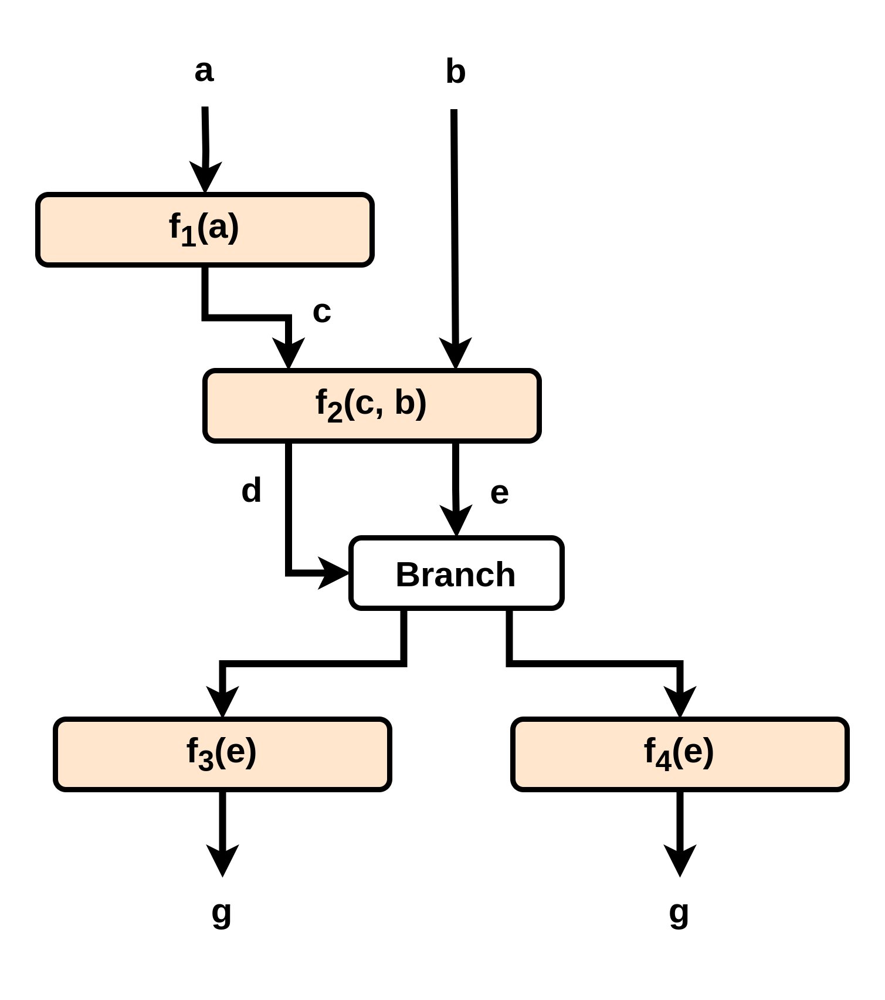

And an example corresponding schedule:

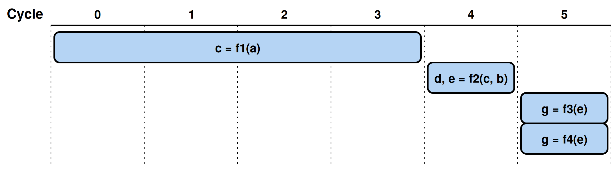

With our token-prediction speculative flow, the circuit is transformed to look as follows:

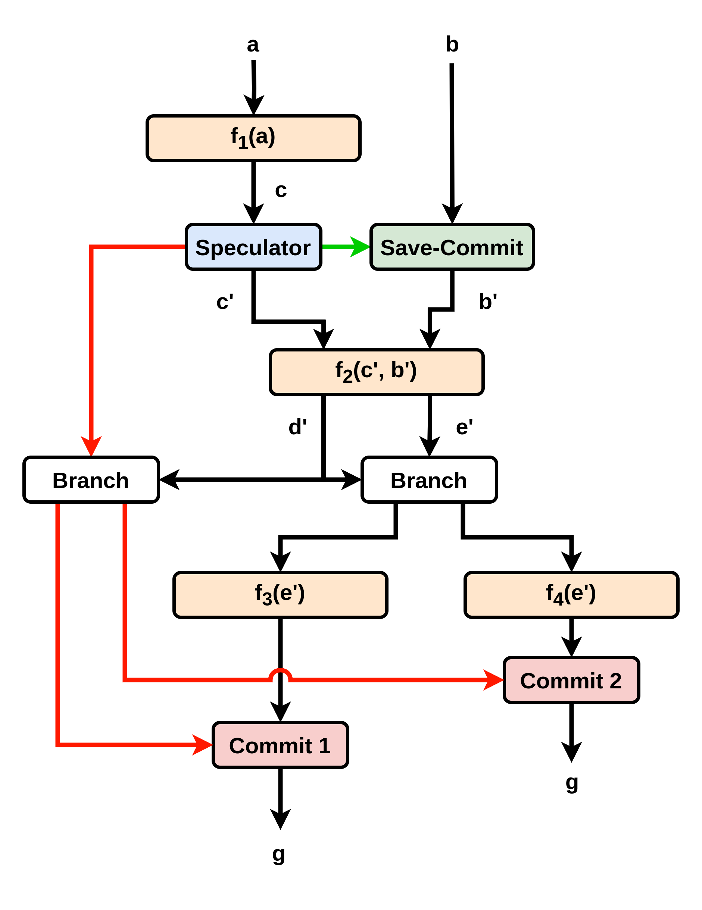

Which in turn implements the following schedule instead:

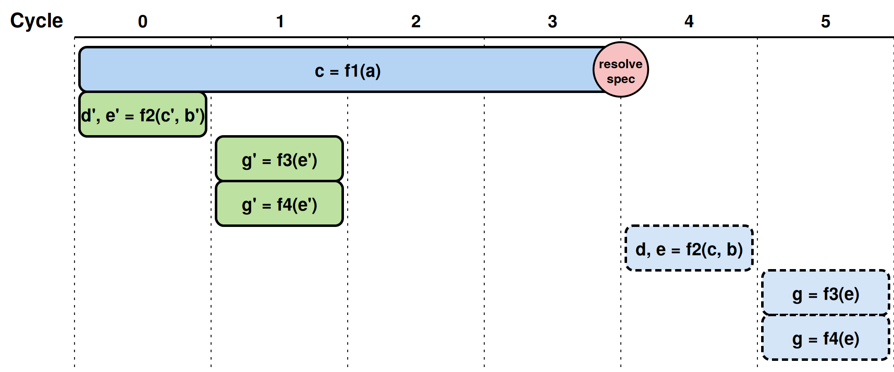

In cycle 0, the speculator issues a predicted value `c'`, and the save-commit saves `b` in its internal memory and issues `b'`, allowing `f2(c', b')` to begin immediately, and perform either `f3(e')` or `f4(e')` in cycle 1. We discover if prediction was correct at the end of cycle 3. The speculator informs either `Commit 1` or `Commit 2` of this, by consuming `d'` a second time along the new red edges. In the case that the prediction of `c` was incorrect, the `Speculator` issues the correct `c`, and informs the `Save-Commit` along the green edge, so the `Save-Commit` re-issues `b`, allowing the original schedule to run in order to recover from the mis-prediction.

#### Example 2

Take the following loop circuit:

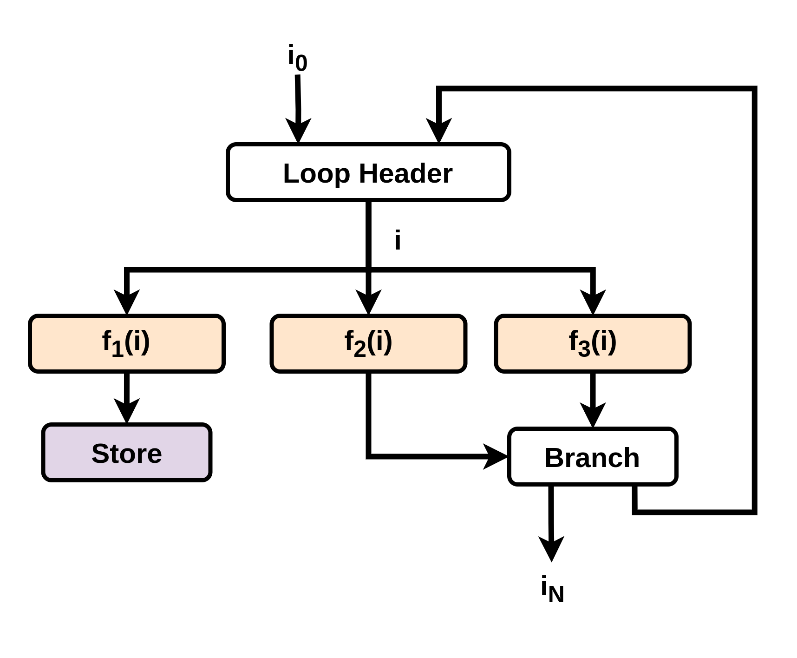

which has the following schedule:

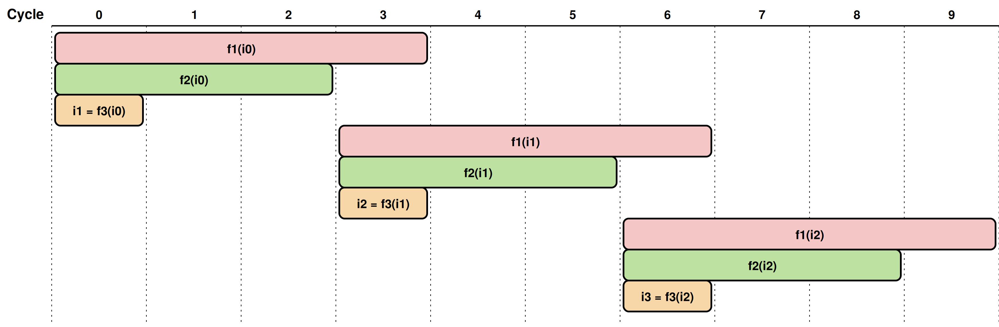

A speculator can be placed on the output of `f2` to improve loop pipelining. The output circuit is as follows:

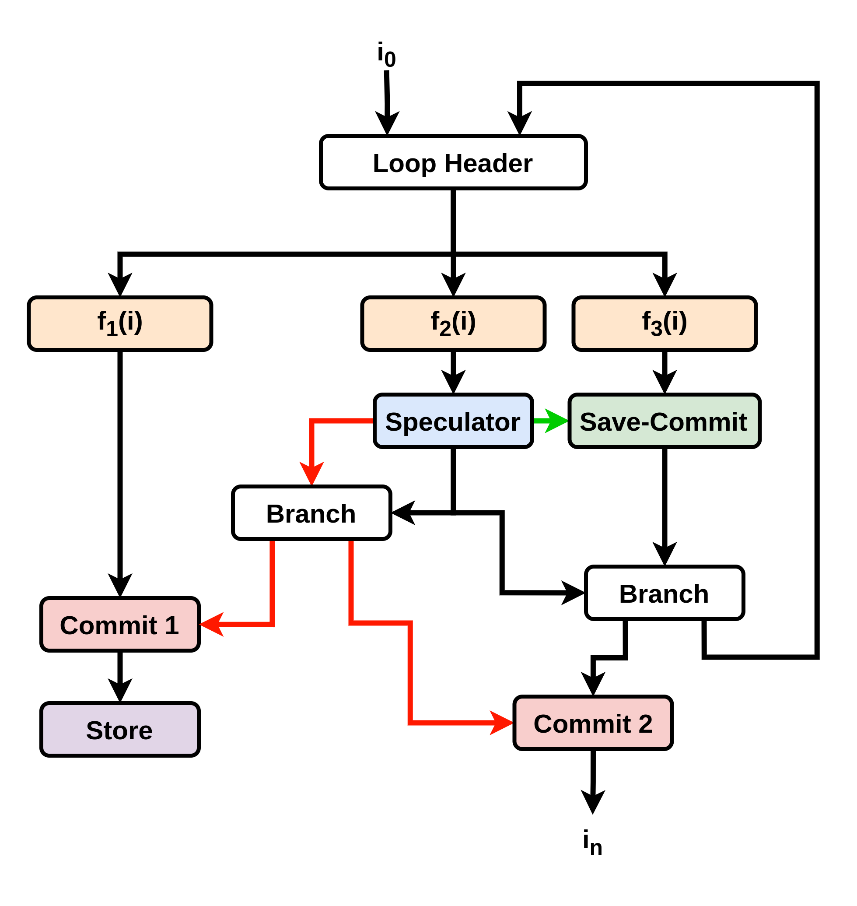

and produces the following schedule:

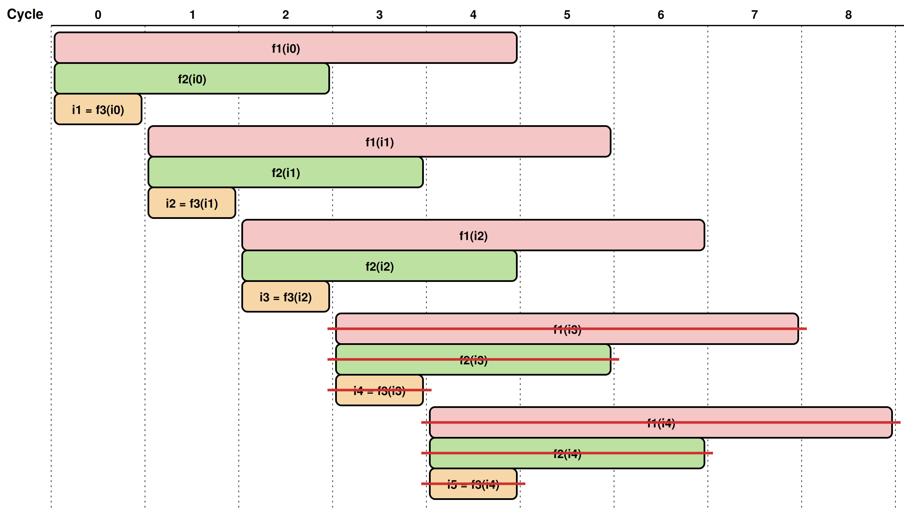

In cycle 0, the save-commit receives `i1` as the output of `f3(i0)`, and the speculator predicts the value of `f2(i0)` as `true`. This causes `i1` to speculatively re-enter the loop. 

Therefore in cycle 1, all functions execute speculatively with `i1` as their input. At the end of cycle 1, the save-commit receives a speculative `i2'` from the speculative execution of `f3(i1)`. The speculator again predicts that the output of `f2` will be `true`, causing `i2'` to re-enter the loop. Even though `i2'` is speculative, and therefore will eventually need to be resolved, the save-commit does not resolve it yet: the save-commits continue to issue values until mis-prediction is detected. This is required to allow multiple predictions to be in-flight simultaneously. 

In cycle 2, all functions execute speculatively with `i2` as their input. The real `f2(i0)` arrives at the input to the speculator, and the speculator discovers its prediction was correct. The speculator then informs the save-commits and commits of the correct prediction. Only `Commit 1` will receive this info, as only `Commit 1` will receive a value from that prediction. The speculator and save-commit allow `i3'` to speculatively re-enter the loop.

Cycle 3 is the same as cycle 2, although with the real `f2(i1)` arriving and `i4` entering the loop.

In cycle 4, the speculator discovers mis-prediction. The real value of `f2(i2)` is `false`. It informs the save-commit of the mis-prediction. The speculator issues a `false` value, and the save-commit re-issues the saved `i3`. `i3` then exits the loop. 

The speculator and save-commit both know they will receive mis-speculated input values as input: `f3(i4)` is currently arriving to the save-commit, and the speculator will still receive `f2(i3)` and `f2(i4)` in later cycles. Both units use a stateful mechanism to `kill` these values, which we describe in more detail later.

In cycles 5 and 6, the speculator sends out a `kill` communication to the commit units for the predicted `f2(i3)` and `f2(i4)`. These will both arrive at only `Commit 1`, as `Commit 2` did not receive any mis-speculated outputs for this executiont trace.


### High-Level Overview: Non-Spec vs. Spec
In our token-prediction speculative approach, there are two types of values: `non-spec` and `spec`.

If a value is `non-spec`, it means no prediction was involved in the creation of this value. Since there is no prediction, that non-existant prediction was never be resolved. This means there will never be a value that arrives from the non-existant resolution to tell us what to do. 

Whenever a `non-spec` value arrives at a point where speculation is resolved, we must automatically apply the same decisions as when we resolve a prediction to have been correct.

If a value is `spec`, a prediction was involved in its generation. When it arrives at a point where speculation is resolved, we must wait to see if it resolved correctly or incorrectly before taking any action. 

We identify `non-spec` vs `spec` data via an additional bit attached to values. 

### High-Level Overview: The Speculator

The core dataflow unit of token-prediction speculative flow is the speculator. Currently, it is placed manually, based on a user-written `#pragma dyn speculate` in the input kernel source code. The speculator can be used to break data dependencies, producing a data output before receiving a data input, by generating predicted values. These values can then be used to begin computations earlier, often resulting in improved circuit performance. The speculator has an internal history of predictions made: for a maximum of N in-flight predictions, this internal history must be at least of size N. 

When the speculator makes a prediction, it informs all the save-commit units so that the speculator and the save-commits all issue their outputs in the same cycle. The speculator may make multiple predictions before the first resolves. 

When a value arrives at the speculator to resolve speculation, the speculator informs the save-commits of the result: correct prediction or incorrect prediction. If prediction was incorrect, the speculator and save-commits re-issue their correct outputs, again all in the same cycle. 

When a prediction is discovered to have been incorrect, all in-flight predictions must also be considered mis-predicted. The speculator therefore switches mode, and sends a `kill` communication to the commit units for each in-flight prediction. The speculator does not communicate with the save-commits during this time. 

An output value of an in-flight prediction may arrive at the speculator. The speculator must therefore `kill` any incoming values which came from in-flight predictions. We describe the exact details of this later. 

### High-Level Overview: The Commit Units

The second unit used in our token-prediction speculative flow is the commit unit. Outputs of the computation done with predicted inputs will eventually reach commit units, which provide a hard boundary of how far a `spec` value can travel from the speculator. 

When the true data input arrives at the speculator, the speculator communicates to these commit units if the prediction was correct or incorrect. If correct, the commit units allows the value to `pass`. If incorrect, the commit unit `kills` the value, preventing the misprediction from impacting the correctness of the circuit's execution. We use `kill` to refer to "dropping" values which are incorrect. 

From the reasoning discussed in [Non-Spec Vs. Spec](#high-level-overview-non-spec-vs-spec), a `non-spec` value is automatically `pass`-ed by the commit unit without receiving any communication from the speculator.

### High-Level Overview: The Save-Commit Units

The third unit of the approach is the save-commit units. Save-commits are involved in speculation beginning but are not involved in speculation resolving.

The speculator may make multiple predictions before the first resolves. If so, the second value that the save-commit receives is the result of the first prediction, and so on. The save-commit 

The primary purpose of the save-commit units is to save values, to allow recovery from mis-prediction. When a computation begins with a predicted input, a set of save-commits save all other inputs to that computation (one save-commit per input). When mis-prediction is discovered, the computation must be re-executed. The speculator issues the real data input for the first time, and each save-commit re-issues their saved value. In order to have up to N in-flight predictions, the save-commits must be able to store N saved values.

The secondary purpose of the save-commit units is the "commit" purpose. This refers to how the save-commit updates its history of stored inputs after mis-prediction is detected. 

When a prediction is discovered to be correct, it means that computation will not be re-executed. The save-commit can therefore `discard` the value it was saving for that re-execution. We use `discard` to refer to 'dropping' values which were correct but are no longer needed. 

When a prediction is discovered to have been incorrect, all in-flight predictions must also be considered mis-predicted. 

An output value of an in-flight prediction may arrive at the save-commit. The save-commit must therefore `kill` any incoming values which came from in-flight predictions. The save-commit and speculator implement this in the same way, and we describe the exact details of this later. 


### High-Level Overview: How to Place Commits

Commit units are placed to limit where unresolved `spec` values can reach. In general, we place commit units to prevent `spec` values from exiting the circuit along any external connection, including being stored to memory. 

Commit units can also be placed to prevent any arbitrary computation from being performed speculatively, for any arbitrary reason.

Additional commit units are also needed for ordering correctness, but we will discuss this later.


### High-Level Overview: The Snapshot Approach (How to Place Save-Commits)

In the "snapshot approach", we use the save-commits units to store a "snapshot" of the state of the circuit at the time the prediction occured. When prediction happens, the save-commits save their incoming values to their internal history, to allow re-issuing of that snapshot. 

If mis-prediction is detected, we `kill` all computational outputs that are generated after the snapshot was created, and roll the entire circuit state back to this point, even if computation occured below the snapshot which was not affected by the mis-prediction. For multiple in-flight predictions, the snapshot approach means that any predictions made after a mis-prediction are also considered mis-predicted. 

The input values to the save-commits are often `non-spec`. However, computational outputs generated from `non-spec` inputs are `non-spec`, and `non-spec` outputs automatically pass through commit units: they cannot be `kill`-ed. The save-commits therefore issue the snapshot as `spec` when prediction happens, to guarantee that all outputs will be `spec`, and therefore all outputs will be `kill`-able if mis-prediction is detected.

In mis-prediction recovery, the speculator issues the correct value as `non-spec`, and all save-commits re-issue their values also as `non-spec`, as no prediction was involved in the issuing of these inputs. 

This guarantees that exactly one value will be generated for each output, even is a snapshot is executed twice.

If any computation receives input only from the save-commit units, and no input from the speculator, this computation will be redundantly re-executed when mis-prediction recovery happens. The placement of the save-commit must therefore trade-off the degree of redundant execution with how many save-commits must be placed to create a full snapshot.

An example below shows a single save-commit above a computation which will never be affected by prediction, with the shapshot point shown as a dashed purple line:

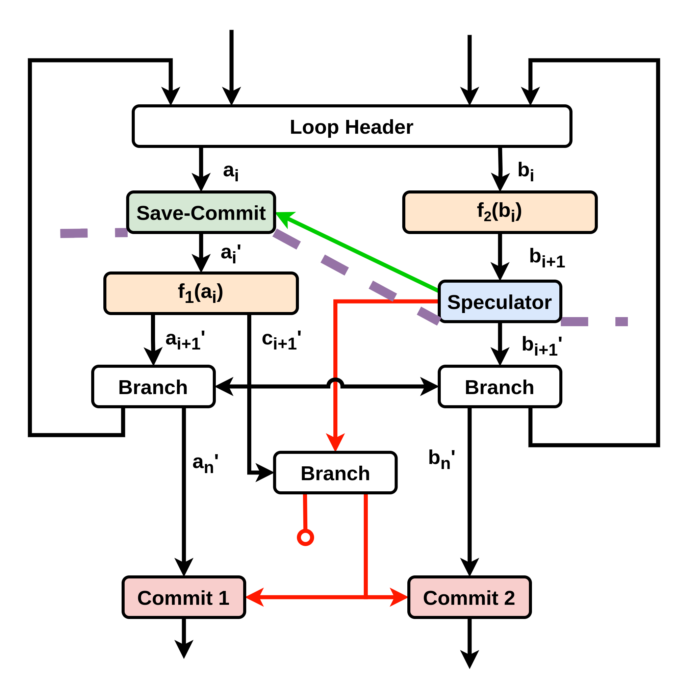

The snapshot approach means the value issued by the save-commit is `spec`, so that the outputs are correctly `kill`-ed when mis-prediction is detected. `f1(ai)` then re-executes with the same inputs (but now `non-spec`) during mis-speculation recovery. 

You can see that the output of the save-commit must be marked as `spec` here. Otherwise, a `non-spec` `ai+1'` would pass through `Commit 1` twice if mis-prediction occurs when `ci+1'` is `false`. This means the circuit would produce two output values along this edge when there should only be one.

Another valid save-commit placement would be two save-commits on the two outputs of `f1(ai)`. This would reduce redundant re-computation, but would require another save-commit. 

## Individual Unit Behaviour

Here we discuss exactly how each unit functions, without extensive discussion of the properties required for this behaviour to result in correct execution.

An important fact (which we will justify more later) is that the save-commits use state to `kill` mis-speculated tokens, and so see no explicit `kill` values as input. Commit units are stateless, and so receive a `kill` or `pass` value along their `control` input for every `spec` input they receive.

### Individual Unit Behaviour: The Commit Unit

The commit unit has two inputs: `data in` and `control`, and one output: `data out`.

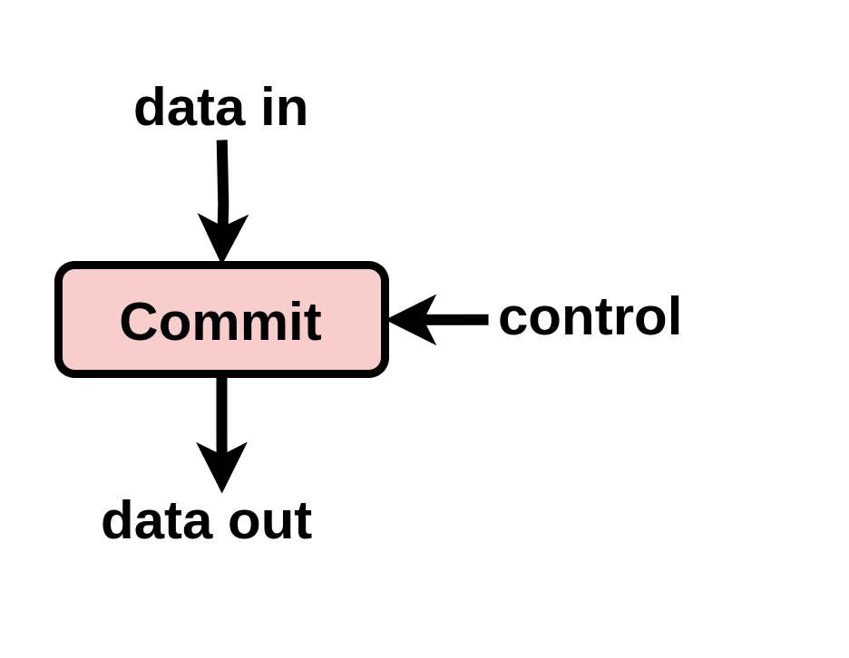

The behaviour of the commit units is different for `non-spec` vs `spec values`:

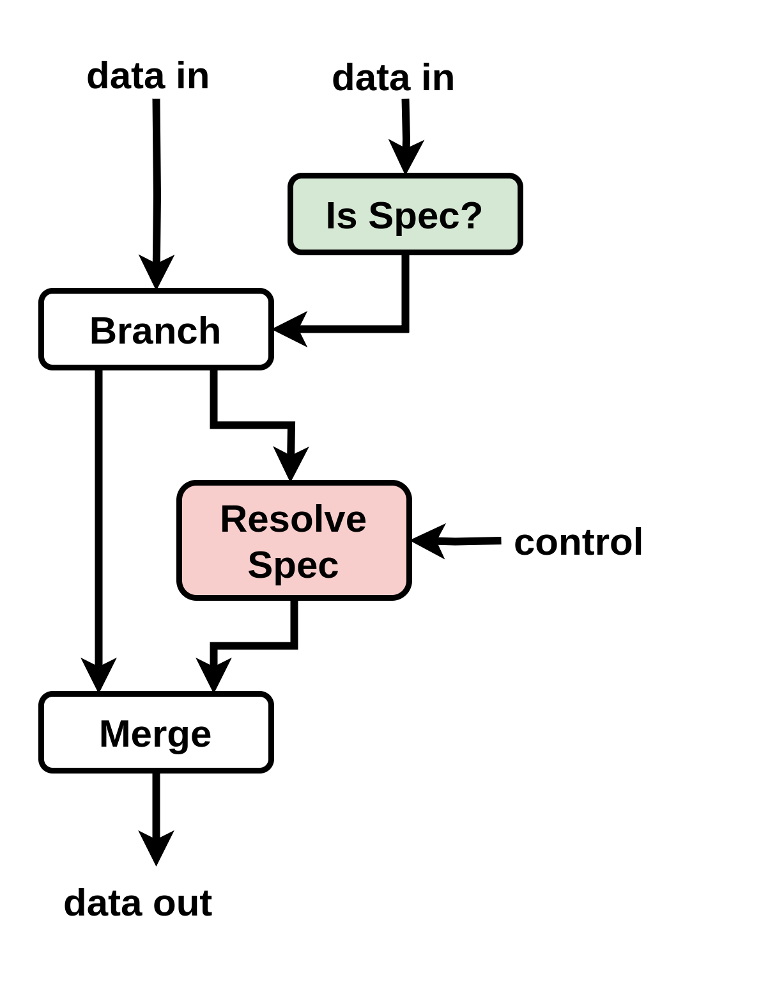

A `non-spec` value has no corresponding `control`, and so passes through the commit unit immediately.

A `spec` value must join with a `control` signal to either be `pass`-ed to the output or `kill`-ed.

### Individual Unit Behaviour: The Save-Commit Unit

The save-commit unit has three inputs: `data in`, `issue control`, and `history control`, and one output: `data out`.

This diagram is the first introduction of how the speculator and save-commit statefully kill values which come from mis-speculation. If the speculator informs the save-commit of mis-prediction, the save-commit wipes its entire history and kills any incoming `spec` values until it sees a `non-spec` value. We will discuss the `non-spec` value as a flag event indicating all mis-speculated values have been killed in more detail later. 

A simplified version of how the save-commit works is shown below, with stateful aspects in purple, mis-prediction recovery aspects in red, and "normal operation" aspects in green:

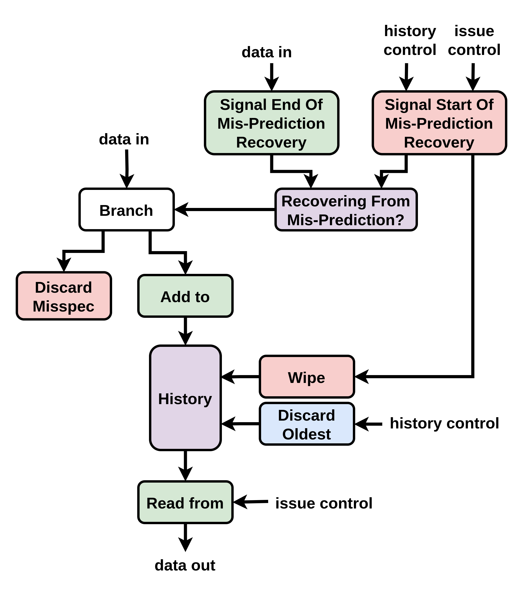

When the save-commit is not recovering from mis-prediction:
1. `data in` is stored in the history.
2. `issue control` is a value from the speculator telling the save-commit to issue a `spec` output, since the rest of the snapshot is valid.
3. `history control` is a value from the speculator telling the save-commit to `discard` its oldest saved value, as it is no longer necessary.

When mis-prediction is discovered, the speculator informs the save-commit using both `history control` and `issue control`:
1. The save-commit re-issues its oldest saved value. 
2. The entire history is wiped.
3. Incoming `spec` data is treated as mis-predicted.
4. The arrival of `non-spec` data is treated as the end of mis-prediction recovery.

This omits some details about the order in which things happen, synchronization between the two control channels, and what happens when the speculator decides not to speculate, which we will discuss in more detail later.

### Individual Unit Behaviour: The Speculator

The logic of the speculator is divided into two halves: a "brain", and a "communicator"

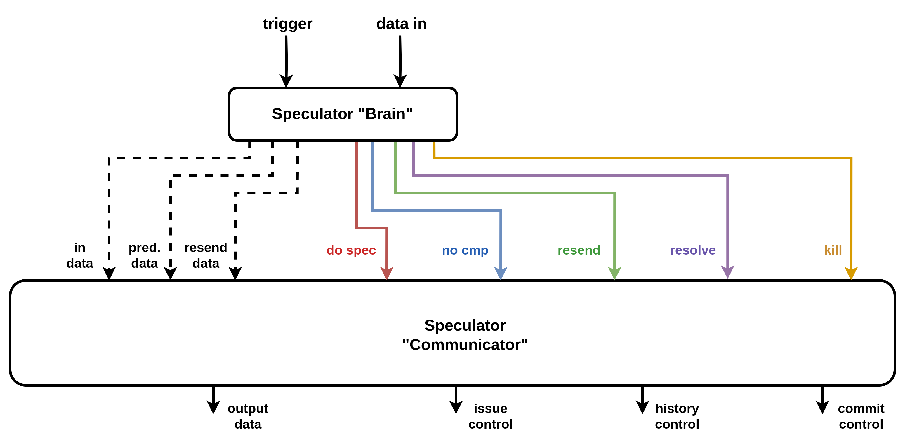

This figure introduces for the first time the `trigger` input of the speculator, which is forked from the control token of the circuit. This is a data-less value Dynamatic uses to indicate a basic block has begun execution. The `trigger` input is used to match the token count between predictions made and `data in` values received, so we can safely use the `data in` input to resolve predictions. 


The speculator "brain" unit has 5 elastic output channels: `no cmp`, `do spec`,  `resend`, `kill`, and `resolve`m as well as 3 data outputs: `in data`, `predicted data`, and `resend data`, which do not have a valid and ready signal. 

The 5 elastic output channels encode the decisions that the speculator "brain" has made. Each decision corresponds to a different set of output values that must be issued from the speculator's 4 outputs. 

The meaning of each of the five events is as follows:

- `do spec`
Perform prediction to begin speculate. Issue the predicted value and inform the save-commits so they can issue their save values.
- `no cmp`
`data in` arrived immediately and there is no need to predict. Pass through all the values as `non-spec`.
- `resolve` 
A new `data in` has arrived and matches our prediction. Tell the commit units to `pass` the outputs, and the save-commits to `discard` their oldest saved values.
- `kill`
In a previous cycle, the speculator discovered a mis-prediction. Now it sends one `kill` event per unresolved in-flight prediction.
- `resend` 
In a previous cycle, the speculator discovered a mis-prediction. `resend` is issued once to the save-commits for them to re-issue their oldest save data and wipe their history, and the speculator also issues the corrected value.

This table shows which of the decision channels can be valid simultaneously:
| `no cmp` | `do spec` | `resolve` | `kill` | `resend` |
|:-:|:-:|:---:|:---:|:---:|
| X |   |   |   |   |
|   | X |   |   |   |
|   | X | X |   |   |
|   |   | X |   |   |
|   |   |   | X |   |
|   |   |   | X | X |
|   |   |   |   | X |

`no cmp` cannot overlap with any other decision: there are no predictions to resolve. The elastic channel means the "communicator" is able to backpressure this decision. 

`do spec` and `resolve` can overlap: the speculator can make a new prediction, resolve an old prediction as correct, or both in a single cycle. The "communicator" can backpressure both decisions along the elastic channel, only one, or neither. 

`kill` and `resend` can overlap: the speculator can `kill` an in-flight mis-prediction, `resend` the correct values, or both in a single cycle. The "communicator" can backpressure both decisions along the elastic channel, only one, or neither. 

####  Individual Unit Behaviour: The Speculator's "Communicator"

The internals of the speculator's communicators look like this:

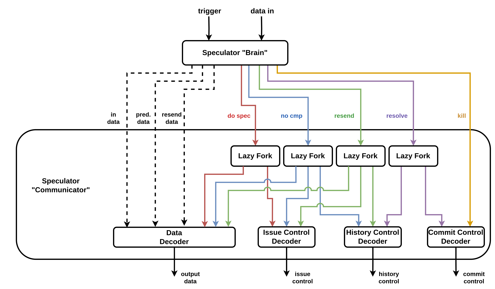

4 decoder units take different actions based on which decision the brain has taken. Each decoder is guaranteed by the mutual exclusivity of the decisions to have only a single valid input in any cycle. 

The lazy forks guarantee that if any decoder backpressures a decision, that decision is not applied. This is because the decision value from the speculator "brain" is volatile: the value can change without the handshake protocol accepting it for transfer. 

The data decoder additionally receives the 3 data values of `in data`, `predicted data` and `resend data`, and chooses which to output based on the incoming decision from the speculator `brain`. 

The Issue Control Decoder communicates with the save-commits, and sends a "issue oldest un-issued value as `spec`" for `do spec`, a "issue oldest un-issued value as `non-spec`" for `no cmp`, and "issue oldest value as `non-spec`" for `resend`.

The History Control Decoder communicates with the save-commits, and sends a "drop oldest saved value" for `no cmp`, a "drop oldest saved value" for `resolve`, and "wipe history" for `resend`.

The Commit Control Decoder communicates with the commit units, and sends a `pass` for `resolve` and a `kill` for `kill`.

####  Individual Unit Behaviour: The Speculator's "Brain"


#####  Individual Unit Behaviour: The Speculator's FSM


The core of the speculator's "brain" is a simple finite state machine.

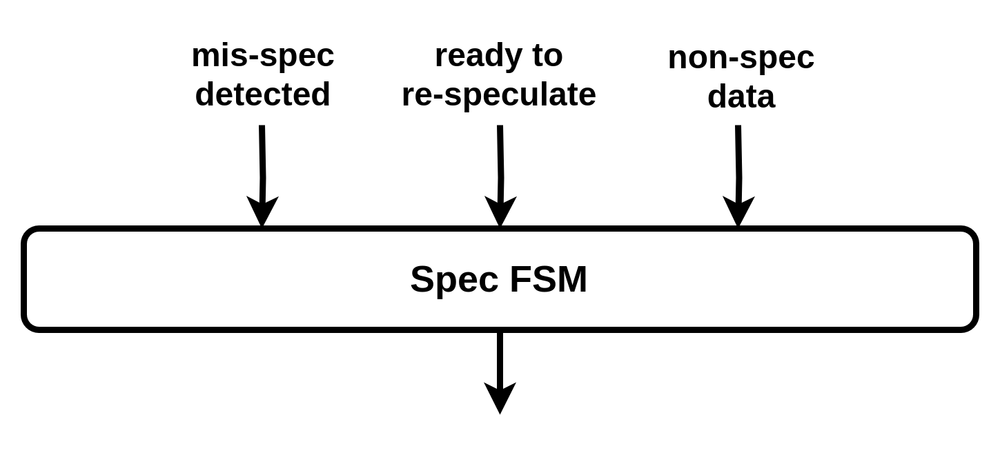

It has 3 inputs: `mis-spec detected`, `ready to re-speculate` and `non-spec data`, and 1 output: `state`.

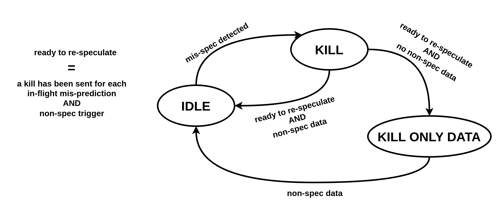

The FSM has three states `IDLE`, `KILL` and `KILL ONLY DATA`. The speculator makes predictions in both `IDLE` and `KILL ONLY DATA`. The speculator only resolves predictions in `IDLE`. In `KILL`, the speculator sends out one `kill` value for each in-flight mis-predictions, and independently attempts to perform `resend`. In both `KILL` and `KILL ONLY DATA`, the speculator `kill`-s any incoming `spec` values, as they are the results of mis-prediction. 

The speculator transitions from `IDLE` to `KILL` when mis-prediction is detected.

An important sub signal is `ready to re-speculate`, which occurs once all `kill`-s have been sent by the "communicator", and the speculator is receiving a `non-spec` `trigger` value. This `non-spec` `trigger` value is a request from the circuit to begin a fresh round of speculation. The arrival of the `non-spec` `trigger` can only happen as a consquence of a successful `resend`, and so the `resend` event is not explicitly in the transition conditions. 

Another signal used in the other three transition is `non-spec` `data`. This `non-spec` `data in` is treated as a flag event meaning that all data values from the in-flight mis-predictions have been been killed.

The speculator transitions from `KILL` to `IDLE` when `ready to re-speculate` occurs and there is `non-spec` data: all `kill`-ing is complete.

The speculator transitions from `KILL` to `KILL ONLY DATA` when `ready to re-speculate` occurs but there is not yet `non-spec` data: some in-flight mis-predictions may not yet have been killed. As mentioned above, the speculator can start making fresh predictions in `KILL ONLY DATA`, which is helpful for performance reasons.

The speculator transitions from `KILL ONLY DATA` to `IDLE` when there is `non-spec` data: all `kill`-ing is complete.

#####  Individual Unit Behaviour: From FSM to Decision

A rough block diagram of the brain as a whole is then:

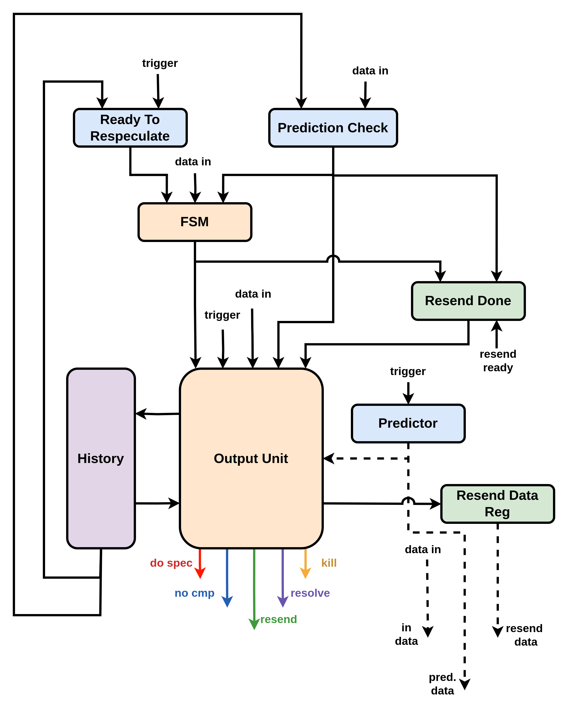

The history stores unresolved in-flight predictions. 

`Ready to Respeculate` takes as input the history and the trigger. If a `kill` has been sent for each mis-prediction, the history will be empty. When the history is empty and the trigger is `non-spec`, `Ready to Respeculate` sends a value. This is used for the FSM transitions.

`Prediction Check` evaluates an incoming true value against the oldest value in the history. If mis-prediction is detected, it informs the FSM and `Resend Done`, as well as the `Output Unit`. If a the prediction was correct, only the `Output Unit` is informed.

The FSM as described before takes in three inputs and outputs the `state`. 

The `Predictor` produces a predicted value for each trigger, based on the specified prediction mechanism. 

`Resend Data Reg` stores the incoming data when mis-prediction is detected, so it can be resent properly. 

The `Output Unit` itself then encodes which decision is made based on the `state`, `trigger`, `data in`, `resend done` and the output of Prediction Check. 

A simple pseudocode is the easiest way to describe the behaviour of the Output Unit:

```
IDLE:
    if mis-prediction detected:
        store data in to resend reg
        accept trigger if present (to kill)
        set resend not done
        # FSM will move to KILL

    else:
        # if statement 1: confirm a correct speculation?
        if data matches prediction:
            emit resolve

            # backpressure from communicator?
            if resolve accepted:
                accept data in
                pop oldest prediction from history

        # if statement 2: did real data arrive 
        # before any prediction
        if data arrived before prediction:
            emit no_cmp

            # backpressure from communicator?
            if no_cmp accepted:
                accept data in
                accept trigger

        # otherwise, speculate on the new trigger
        else if trigger present and history has room:
            emit do_spec

            # backpressure from communicator?
            if do_spec accepted:
                accept trigger
                push prediction into history

KILL:
    if data in is spec:
        accept data in if present (to kill)
    if trigger is spec:
        accept trigger if present (to kill)

    if history not empty:
        emit kill

        # backpressure from communicator?
        if kill accepted:
            pop oldest prediction from history

    if not resend done:
        emit resend

        # backpressure from communicator?
        if resend accepted:
          set resend done

KILL_ONLY_DATA:
    if data in is spec:
        accept data in if present (to kill)

    # if data in is non-spec
    # FSM will move from KILL_ONLY_DATA

    # speculate on the new trigger
    if trigger present and history has room:
        emit do_spec
        if do_spec accepted:
            accept trigger
            push prediction into history

```


## Speculator to Save-Commit Communication

The communication between the speculator and save-commit is rife with deadlock risks. 

Take for example a speculator and save-commit in a do-while loop:

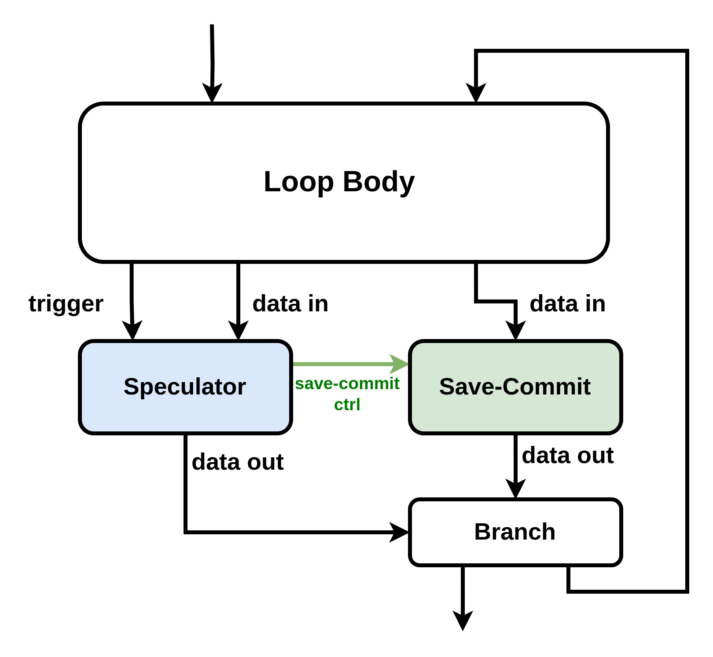

Whenever backpressure is present on the data out channel of the save-commit, it cannot accept instructions from the speculator relating to issuing. However, to remove this backpressure, the save-commit may need to `discard` a value from its internal history, so it can accept a new value on the data in channel. Therefore, to avoid deadlocking, the save-commit must be able to accept a history-based instruction from the speculator even when 1) it has backpressure at its input and 2) the speculator also wants it to issue. 

In order to be able to have independent transfer of the two types of instructions, we need two handshaking channels. We call these two channels the `issue control` and the `history control`.

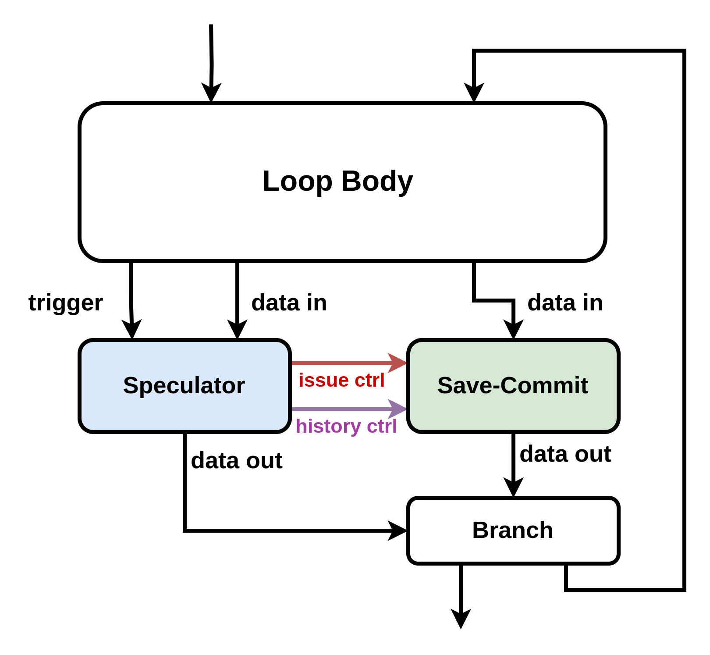

When backpressure propagates to the `issue control` channel, a value can still transfer on the `history control` channel, freeing up space in the save-commit and preventing deadlock.

Two handshaking channels between two units poses a issue: there is no guaranteed relative arrival order between the two channels. However, the speculator expects its instructions to be applied in the order they are issued. Additionally, some instructions affect the internal history and also require a value to be issued. How should these instructions be communicated and applied to ensure correctness?

The solution is synchronized acceptance of problematic instructions. Any instruction which affects both the internal history and the issuing of values must be applied after all previous instructions have been successfuly applied. To avoid the instruction overtaking a value on the other channel, we send the instruction along both channels, and only accept it once it has arrived on both channels.

Take for example this situation:

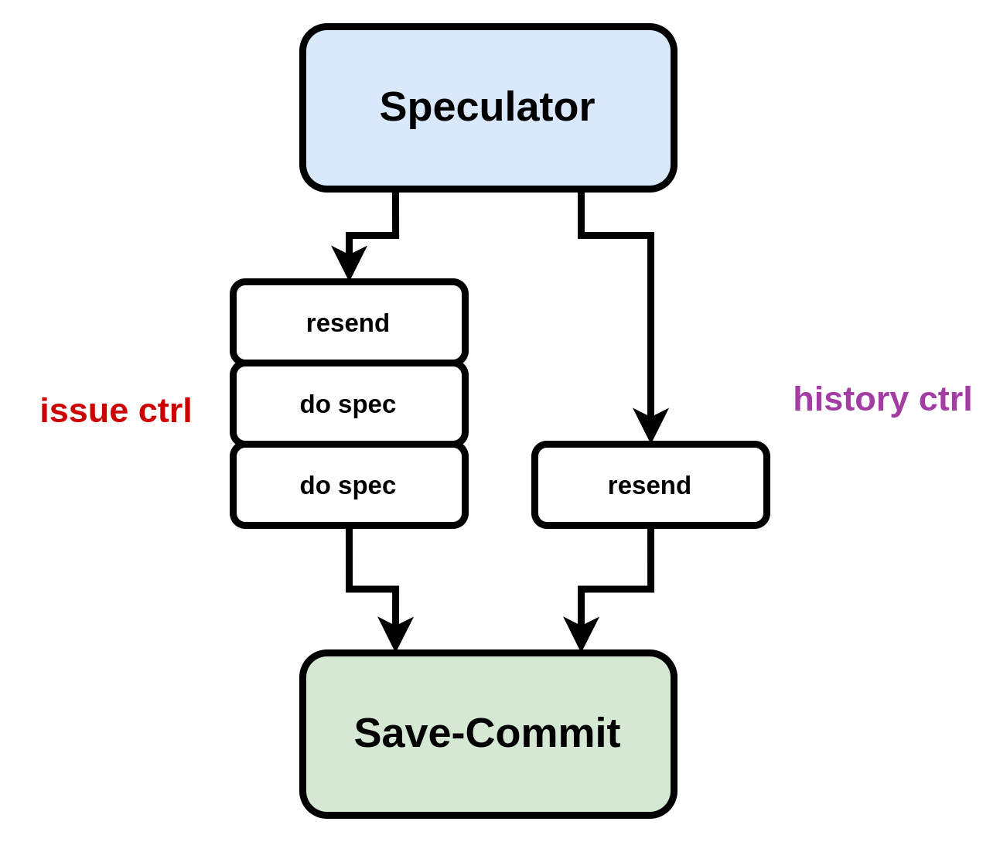

The speculator has sent `do spec` twice along `issue control` and then `resend` on both `issue control` and `history control`. `resend` wipes the internal history and `do spec` reads from the internal history: if we apply these in the wrong order, the `do spec` instruction will have nothing to send. Synchronized acceptance means the save-commit sees the `resend` along `history control`, but does not accept it until `resend` also arrives along `issue control`.

## Save-Commit Mis-Prediction Recovery

Save-commit mis-prediction recovery poses a challenge due to the dual requirements of 1) re-sending the original value as `non-spec` and 2) discarding all mis-speculated values.

### Situation 1: Resolving Deadlock

Take the following situation:

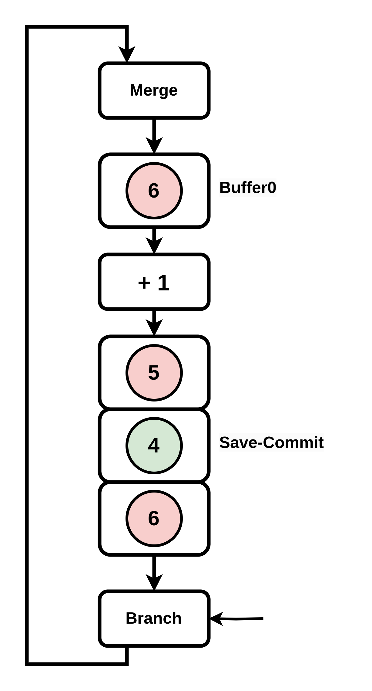

The pointer-based prediction history of the save-commit wants to resend the `4`, the green value, and have it arrive in `Buffer0`. However, `Buffer0` is full with `6`: the speculator has two unresolved mis-predictions, which on the cycle through the save-commit are present as `5` and `6`.

The save-commit must accept the value from `Buffer0` before it can re-issue `4`. However, the save-commit knowns any incoming values must be mis-speculated. Therefore, to resolve the deadlock, it accepts the value from `Buffer0` without placing it in its history or passing it onwards. This in practice `kill`-s the value.

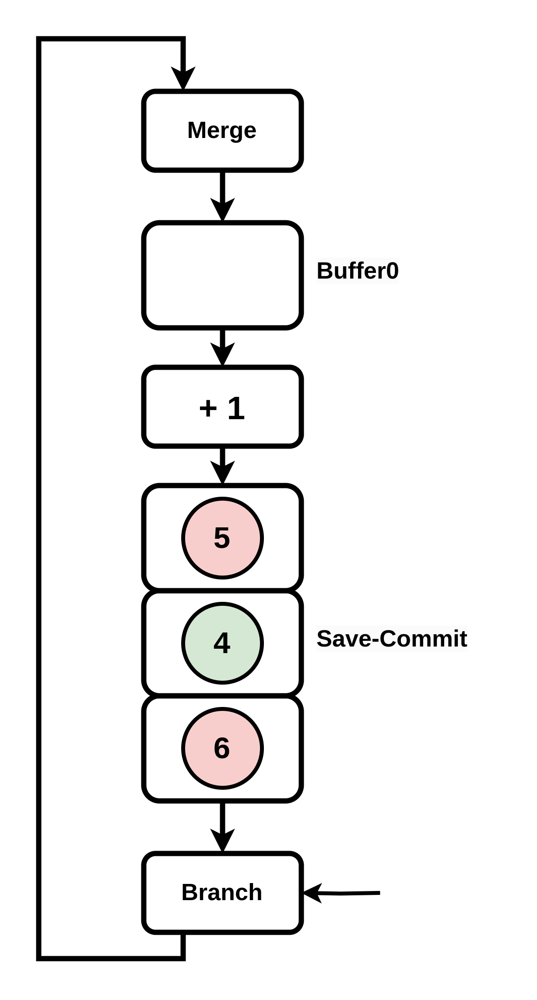


With `Buffer0` now empty, the save-commit can resend the green `4` value. As it does so, it completely resets its pointers, clearing its entire prediction history.

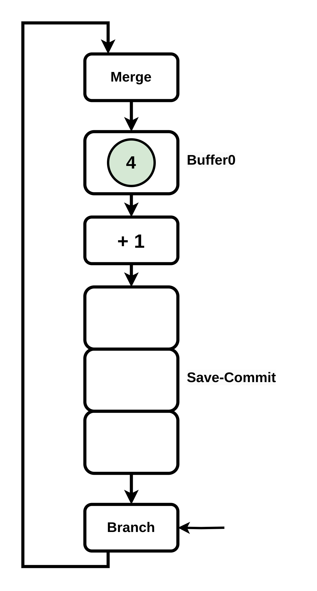

### Situation 2: Killing Later Mis-Speculations

Consider another situation, where `Buffer0` has 3 slots and a latency of 3.
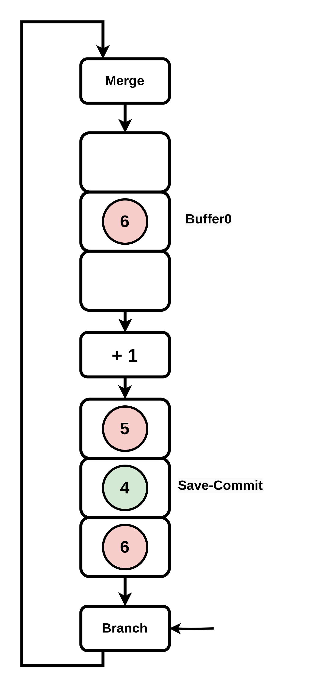

The save-commit can immediately re-issue the value `4` and reset its pointers. 

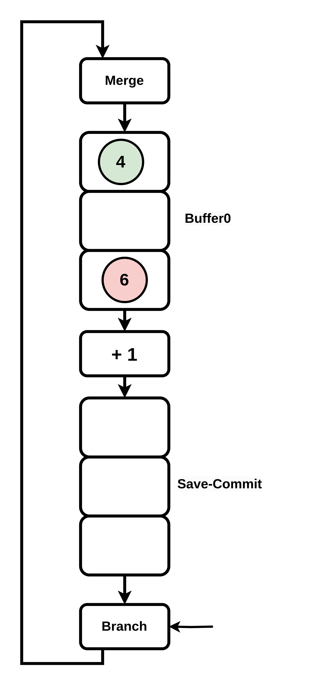

However, the save-commit will still receive the mis-speculated `6` value after having performed the resend. 

Therefore, save-commits kill all incoming `spec` value after resend until a `non-spec` value arrives.

### Pseudo-Code

Pseudo-code of the save-commits behaviour is:

```
NORMAL:
      # speculate
      if ctrl_issue is DO_SPEC:
          if no unsent data:
              if input data valid and space to store:
                  emit input data as speculative
                  if consumer ready:
                      accept ctrl_issue
                      update pointers for the transfer
          else:
              emit oldest unsent data as speculative
              if consumer ready:
                  accept ctrl_issue
                  update pointers for the transfer

      # discard the oldest data since speculation resolved as correct
      if ctrl_history is RESOLVE:
          accept ctrl_history
          discard oldest data

      # resend the oldest token to recover from misspeculation
      # — requires RESEND on BOTH control channels simultaneously
      if ctrl_issue is RESEND and ctrl_history is RESEND:
          emit oldest token
          set entering recovery
          if consumer ready:
              accept ctrl_issue
              accept ctrl_history
              reset pointers
              # FSM moves to RECOVERY

      # use the input data non-speculatively
      # — requires NO_CMP on BOTH control channels simultaneously
      if ctrl_issue is NO_CMP and ctrl_history is NO_CMP:
          if no data:
              if input data valid:
                  emit input data    
          else:
              emit oldest data

          if consumer ready and emitting data:
              accept ctrl_issue
              accept ctrl_history
              update pointers for the transfer

      if entering recovery and input is spec:
          accept input (killed)
      else if input arrives and space to store:
          accept input, write to memory

  RECOVERY:
      if input is spec:
          accept input (killed)

      if input is non-spec:
          exit recovery
```

## Buffering a Speculative Dataflow Circuit


### Background

To achieve maximum throughput of a dataflow circuit, we must ensure that pipelined units in that circuit have enough occupancy. The steady-state throughput of a pipelined unit is a function of its steady-state occupancy: for a given unit with a latency of `L` and steady-state occupancy `N`, the steady-state throughput `θ` will be equal to `N/L`. Increasing the occupancy of the unit therefore increases the throughput of the unit. If the unit is the lowest-throughput unit in the circuit, increasing its throughput increases the throughput of the circuit as a whole.

Whenever a dataflow circuit contains reconvergent paths, that is two (or more) disjoint paths which begin at a common vertex and end at a common vertex, those paths will have identical steady-state occupancies: tokens must enter all paths at an equal rate and leave all paths at an equal rate. However, occupancy is limited by capacity: a path cannot contain more tokens than it has slots. If one of the paths has a low capacity, all paths will have their occupancy limited by that capacity, which as discussed above, can limit throughput. Therefore, for throughput maximization, it can be required to place additional buffer slots to increase capacity.

This can be seen in the figure below:

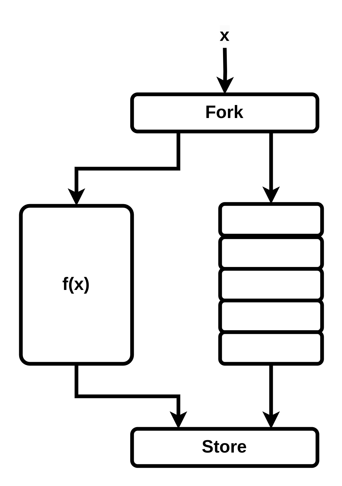

If we wish to achieve a throughput of `1` through `f(x)`, which has a latency of `5`, it must have an occupancy of `5`. `f(x)` is on a reconvergent path from a fork unit to a store unit. In order for `f(x)` to have an occupancy of `5`, the other path from the fork to the store unit must have an occupancy of `5`. In order for the other path to have an occupancy of `5`, it must have at least a capacity of `5`. Therefore to maximize the throughput of `f(x)`, we place 5 buffer slots on the other path from the fork unit to the store unit.

### Reconvergent Paths from Speculator to Commit Units

Take the following example circuit, which is the simplest real example of what a speculative dataflow circuit can look like:

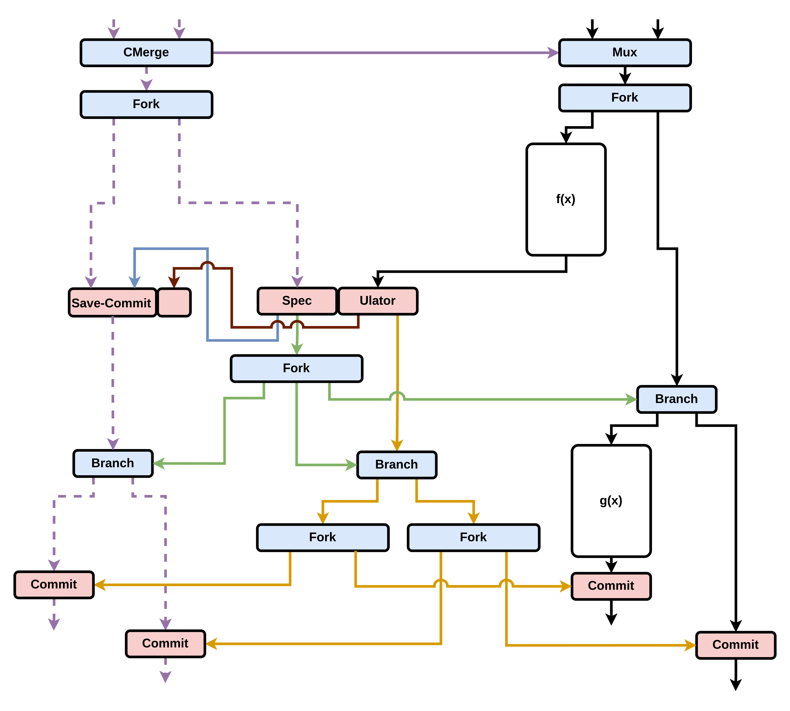

In order to achieve maximum throughput, we must ensure `f(x)` and `g(x)` have enough steady-state occupancy, and therefore we must ensure that any path on a set of reconvergent paths which include these units have enough capacity. 

In order to correctly identify reconvergent paths, we must examine the speculator, which has two inputs and four outputs. Despite having multiple inputs, the speculator does not act as a join: the input paths do not converge at the speculator and so the speculator cannot be the end vertex of reconvergent paths. In steady state, the speculator produces the the `issue control` and `data out` outputs (blue and green edges, respectively), whenever it receives a `trigger` input (purple). The speculator then produces (again in steady state), the `history control` and `commit control output` (brown and orange, respectively) when it receives the `data in` input (black). In the figure, we show the speculator unit broken in two (`spec` and `ulator`) to show the input-output semantics. 

We must also examine the save-commit unit: while the `data in` input and `issue control` input are joined inside the save-commit to produce the `data out` output, the `history control` input is not involved in producing outputs from the save-commit (in steady-state).

To identify a set of reconvergent paths, let us filter this circuit to only look at a single commit unit. 

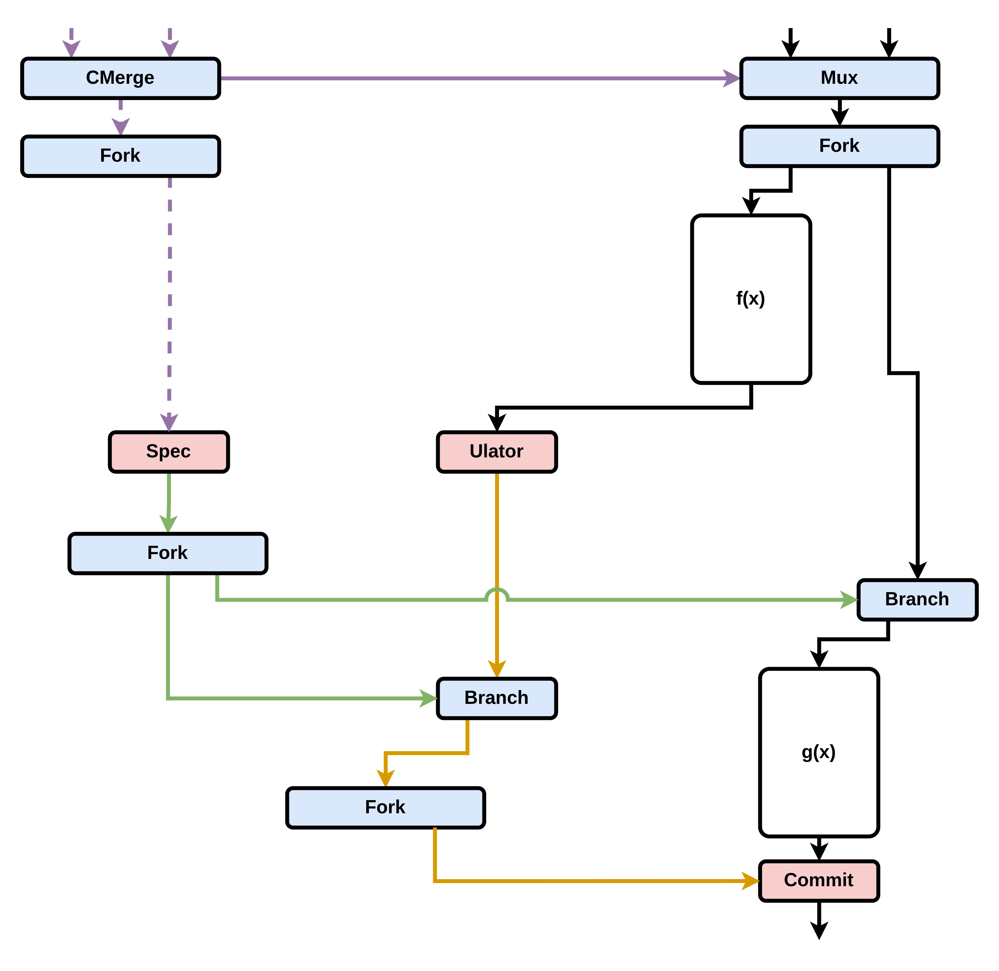

The first reconvergent path is from CMerge unit down to the Branch unit joining the green and orange paths. One capacity solution would be to place buffer slots on the green input, to avoid limiting the occupancy of `f(x)`:

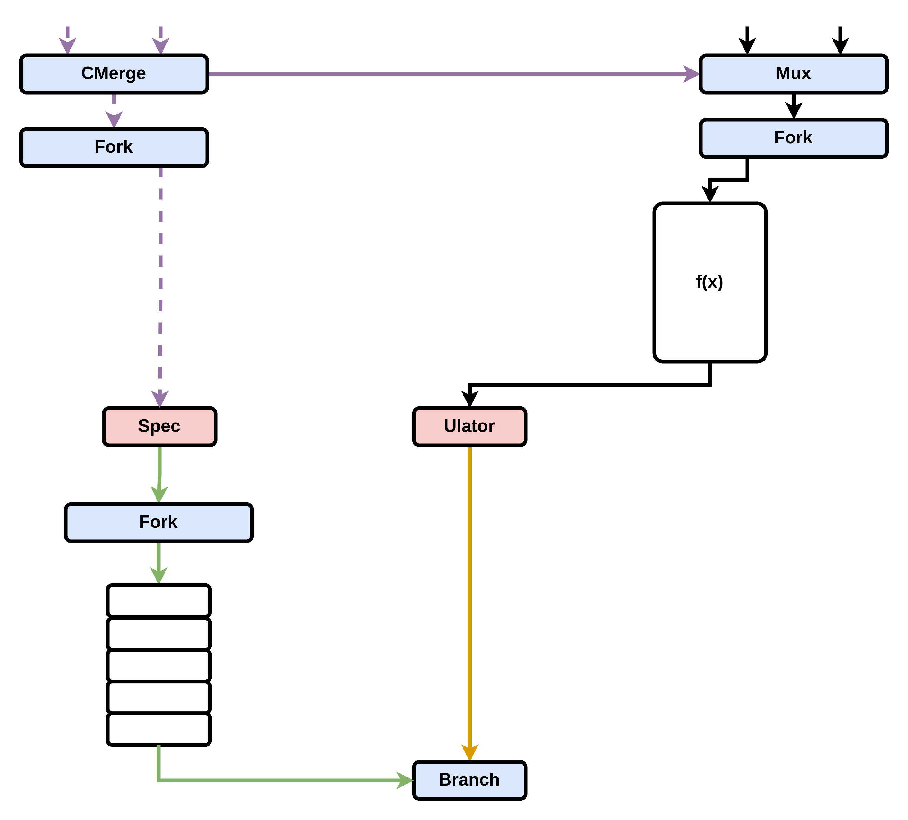

Another reconvergent path is from the Fork unit through both `f(x)` and `g(x)`. If `g(x)` has a longer latency than `f(x)`, additional buffering may be required on the commit unit's `commit control` input:

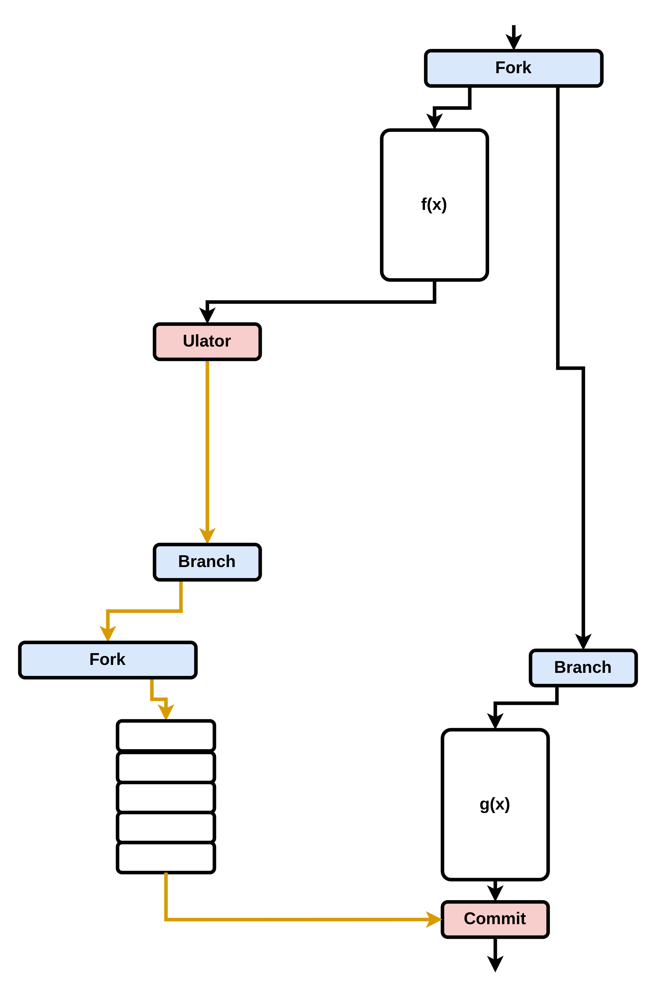

This non-exhaustive reconvergent path analysis illustrates how we must characterize the speculative units to the buffering approach, for it to correctly identify reconvergent paths and therefore additional capacity requirements. 

### Speculative Units Re-Timing

The buffering approach used by Dynamatic represents token occupancy using **fluid retiming variables**. The absolute value of a fluid retiming variable has no particular meaning. However, the difference between two fluid retiming variables indicates the occupancy of the path(s) between those two points during steady-state execution. 

Most units in Dynamatic have a single fluid retiming variable, as there is a single path through the unit. 

The figure below shows two important concepts: 1) for a set of reconvergent paths, the difference between the fluid retiming variables at the start and end vertices is the steady-state occupancy of the reconvergent paths, and 2) the difference between the retiming variables at the top and bottom of a channel indicate how many buffer slots the buffering approach has requested be placed on that channel.

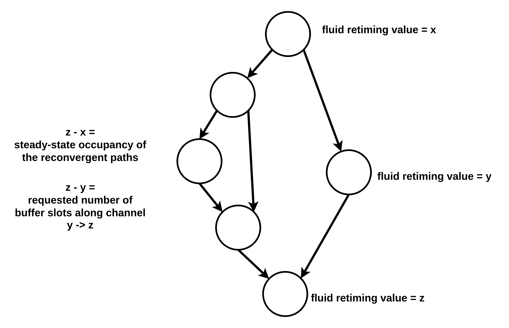

The buffering approach then uses a linear solver to select values for fluid retiming variables which maximize the occupancy of pipelined operations and therefore throughput, while minimizing the number of buffers placed. It additionally minimizes critical path delay, and minimizes the number of opaque buffers sequentially placed on cycles (these can separately limit throughput).

The figures below specify the retiming variables used with the buffering approach for the speculative units: 

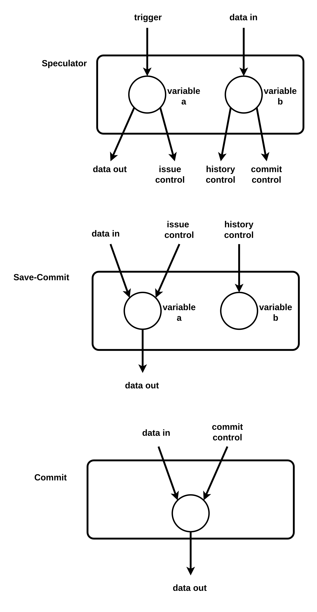

The speculator has two independant paths with independant occupancies, the save commit has one real (joined) path and one dead end, and the commit unit is a normal single-path unit.

### Additional Buffering

Beyond the throughput-maximizing buffers placed by the buffering approach, speculative dataflow circuits require a handful of extra buffers. Some of these we specify to the buffering approach as additional requirements, and one we add post-automated-buffering.

#### Additional Automated Buffering Requirements

The speculator requires at least 1 transparent buffer on 3 of its 4 outputs.

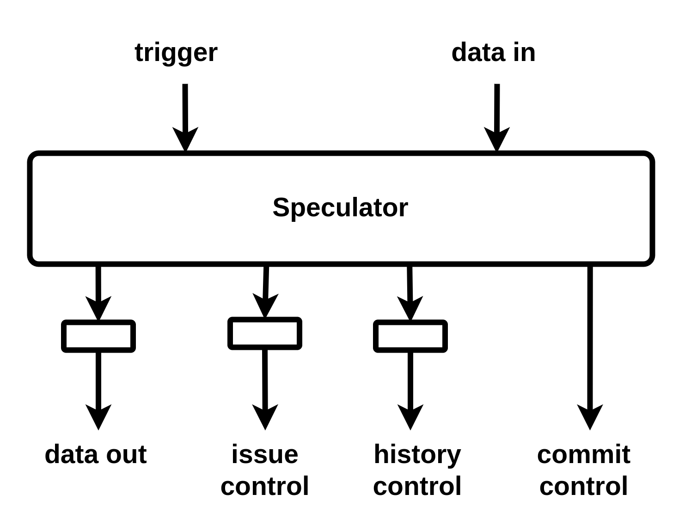

For `data out` and `issue control`, this buffer must be placed directly after the speculator. This is because `data out` and `issue control` are volatile: they may change their value without having the previous value be accepted. This is unsafe to connect to an eager fork unit, as an eager fork unit forwards input data without accepting it. Volatile channels connected to an eager fork can cause the consumers of the eager fork to receive different values when they should all receive the same value. `data out` and `issue control` are volatile as the change their value when mis-prediction is detected, which could occur at any point.

`history control` is not volatile. However, `history control` and `issue control` are produced by a lazy fork, and may be joined together in the save-commit unit. Lazy forks outputs which converge at a join can deadlock if an output channel has zero capacity. To avoid this, we request at least one buffer on the `history control` from the buffering approach. 

#### Additional Extra Buffers for Performance 

One aspect of the speculative units that is unrepresentable to the buffering approach is the conditional join at the commit units.

We re-include here the commit unit internals figure:


A `non-spec` `data in` of iteration 0 will pass through the commit unit before a `control` token arrives. Then, if prediction occurs, the `data in` from iteration 1 will arrive as `spec`. The `control` value from iteration 0 will then join with it.

This cross-iteration joining means that the capacities required for maximized occupancy calculated by the buffering approaches may not be correct. 

To join with the same input but from iteration `i + 1` instead of `i` means the reconvergent path should include the "cycle update calculation", but is does not. In Dynamatic, the steady-state occupancy of the "cycle update calculation" is always exactly 1, as the cycle is guaranteed to contain exactly a single token. 

The steady-state occupancy of the reconvergent paths may therefore actually be 1 larger than the buffering approach identifies. The capacity of the `commit control` channel may therefore need to be 1 more than the number requested by the buffering approach. For this reason, we identify all commit unit at which a cross-iteration join may occur, and add 1 additional buffer slot on the commit control input.